# AI Glossary

Generated from glossary/terms.yaml – as of 2026-09-03.  
Changes please via PR in the repo, not directly in the Wiki.

## 1. Fundamentals & Core Concepts

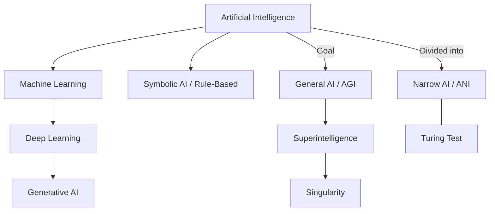
**Sources:** [Moterra](https://moterra.com/ai-map-simplified-understanding-ai-ml-dl-and-genai/), [DIN](https://www.din.de/resource/blob/772610/e96445ca1cbb372071981604ca9f07a2/normungsroadmap-ki-data.pdf), [Coursera](https://www.coursera.org/de-DE/articles/ai-vs-deep-learning-vs-machine-learning-beginners-guide), [webconsulting](https://www.webconsulting.at/blog/ki-kompendium-business-bildung-2025)

| Term (EN) | Begriff (DE) | Explanation | Context | Source |
|---|---|---|---|---|
| Artificial Intelligence (AI) | Kuenstliche Intelligenz | Computer systems that mimic human abilities such as seeing, speaking, or making decisions. | The umbrella term for the whole field. | [1](https://moterra.ai/blog/ai-map-simplified-understanding-ai-ml-dl-and-genai), [2](https://www.din.de/resource/blob/772610/e96445ca1cbb372071981604ca9f07a2/normungsroadmap-ki-data.pdf) |
| Machine Learning (ML) | Maschinelles Lernen | Systems learn automatically from patterns in data instead of being explicitly programmed. | A subset of AI. | [1](https://www.ki.nrw/ki-schluesselbegriffe/), [2](https://www.coursera.org/de-DE/articles/ai-vs-deep-learning-vs-machine-learning-beginners-guide) |
| Deep Learning (DL) | Tiefes Lernen | ML using artificial neural networks with many layers ("deep"). | A subset of ML. | [1](https://www.coursera.org/de-DE/articles/ai-vs-deep-learning-vs-machine-learning-beginners-guide), [2](https://www.youtube.com/watch?v=KI-Lernen) |
| Generative AI (GenAI) | Generative KI | A form of AI that creates new content (text, images, music, code). | A branch of AI. | [1](https://www.webconsulting.at/blog/ki-kompendium-business-bildung-2025), [2](https://digitaleneuordnung.de/blog/ki-begriffe) |
| General AI (AGI) | Starke KI | A theoretical AI that could solve any cognitive task as well as a human. | A long-term research goal. | [1](https://www.webconsulting.at/blog/ki-kompendium-business-bildung-2025), [2](https://our-languages.canada.ca/en/artificial-intelligence-terminology-concept-map-eng) |
| Narrow AI (ANI) | Schwache KI | AI optimized for one very specific task (e.g. chess). | Almost all of today's systems. | [1](https://www.webconsulting.at/blog/ki-kompendium-business-bildung-2025), [2](https://www.din.de/resource/blob/772610/e96445ca1cbb372071981604ca9f07a2/normungsroadmap-ki-data.pdf) |
| Superintelligence (ASI) | Superintelligenz | An AI that far exceeds human intelligence in every domain. | Theoretically follows AGI. | [1](https://www.webconsulting.at/blog/ki-kompendium-business-bildung-2025) |
| Singularity | Singularitaet | The point at which AI improves itself so fast that humans can no longer keep up. | A future scenario (around 2045). | [1](https://www.webconsulting.at/blog/ki-kompendium-business-bildung-2025) |
| Turing Test | Turing-Test | A 1950 test: can an AI convince a human it is human in chat? | A historical benchmark for intelligence. | [1](https://www.ki.nrw/ki-schluesselbegriffe/), [2](https://www.webconsulting.at/blog/ki-kompendium-business-bildung-2025) |
| Algorithm | Algorithmus | A precise, step-by-step procedure for solving a task. | The mathematical basis of every piece of software. | [1](https://www.ki.nrw/ki-schluesselbegriffe/), [2](https://www.din.de/resource/blob/772610/e96445ca1cbb372071981604ca9f07a2/normungsroadmap-ki-data.pdf) |
| Artificial General Intelligence (AGI) | Künstliche allgemeine Intelligenz | A theoretical AI able to perform any intellectual task a human can, across all domains. | Considered the "holy grail" of AI research; does not exist yet today. | [1](https://www.zendesk.de/blog/ai/generative-ai-glossary/) |

## 2. Technology, Architecture & NLP

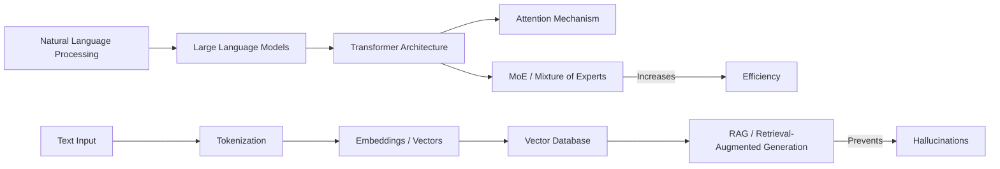

| Term (EN) | Begriff (DE) | Explanation | Context | Source |
|---|---|---|---|---|
| Foundation Model | Basismodell | Massively trained models that serve as a broad technological base for many different applications. | Lets a single model (e.g. GPT-4) be used for hundreds of different tasks. | [1](https://joerg-loehr.com/ki-glossar) |
| Large Language Model (LLM) | Grosses Sprachmodell | A huge neural network trained to understand and generate language. | The basis for ChatGPT, Claude, etc. | [1](https://mdai.ch/blog/von-llm-bis-halluzination/), [2](https://www.webconsulting.at/blog/ki-kompendium-business-bildung-2025) |
| Natural Language Processing (NLP) | Sprachverarbeitung | An AI field that helps computers understand, interpret, and generate human language. | Enables functions like text classification, sentiment analysis, and automated translation. | [1](https://www.zendesk.de/blog/ai/generative-ai-glossary/) |
| Knowledge Graph | Wissensgraph | A semantic network structure that graphically represents information and its relationships. | Lets AI systems logically link information via nodes (entities) and edges (relationships). | [1](https://ki-zentrum.ch/studien) |
| Transformer | Transformer | The modern architecture that allows parallel processing of text context. | The "T" in GPT. | [1](https://www.ki.nrw/ki-schluesselbegriffe/), [2](https://www.webconsulting.at/blog/ki-kompendium-business-bildung-2025) |
| Attention Mechanism | Attention-Mechanismus | Lets the AI weight the most important parts of an input more heavily. | The core innovation of the Transformer. | [1](https://www.webconsulting.at/blog/ki-kompendium-business-bildung-2025) |
| Token | Token | The basic unit (word pieces or syllables) that text is broken into for the AI. | The "currency" of AI processing. | [1](https://www.webconsulting.at/blog/ki-kompendium-business-bildung-2025), [2](https://digitaleneuordnung.de/blog/ki-begriffe) |
| Tokenization | Tokenisierung | The process of splitting text into individual tokens. | The first step of text processing. | [1](https://www.webconsulting.at/blog/ki-kompendium-business-bildung-2025), [2](https://digitaleneuordnung.de/blog/ki-begriffe) |
| Embeddings | Embeddings | Converting words into rows of numbers (vectors) so meaning becomes computable. | The basis for semantic search. | [1](https://www.webconsulting.at/blog/ki-kompendium-business-bildung-2025), [2](https://digitaleneuordnung.de/blog/ki-begriffe) |
| Retrieval-Augmented Generation | RAG | The AI looks up external sources (e.g. the internet) before answering, to check facts. | A method against hallucinations. | [1](https://www.zendesk.de/blog/ai/generative-ai-glossary/), [2](https://www.webconsulting.at/blog/ki-kompendium-business-bildung-2025), [3](https://www.youtube.com/watch?v=KI-Lernen) |
| Vector Database | Vektor-Datenbank | A specialized database that finds content by meaning instead of by keywords. | Essential for RAG systems. | [1](https://www.webconsulting.at/blog/ki-kompendium-business-bildung-2025), [2](https://digitaleneuordnung.de/blog/ki-begriffe) |
| Hallucination | Halluzination | The AI confidently states false facts or invents sources. | A well-known problem with LLMs. | [1](https://mdai.ch/blog/von-llm-bis-halluzination/), [2](https://digitalzentrum-berlin.de/blog/ki-glossar), [3](https://www.webconsulting.at/blog/ki-kompendium-business-bildung-2025) |
| Context Window | Kontext-Fenster | The "short-term memory" – how much text the AI can process at once. | Limits the length of PDFs/chats. | [1](https://www.webconsulting.at/blog/ki-kompendium-business-bildung-2025), [2](https://www.youtube.com/watch?v=KI-Lernen) |
| Mixture of Experts (MoE) | MoE / Sparse Models | An architecture in which only specialized parts of a model are active per request. | Makes huge models more efficient. | [1](https://www.webconsulting.at/blog/ki-kompendium-business-bildung-2025) |
| Inference | Inferenz | The actual use of the finished model on a new question. | The phase after training. | [1](https://www.webconsulting.at/blog/ki-kompendium-business-bildung-2025), [2](https://www.din.de/resource/blob/772610/e96445ca1cbb372071981604ca9f07a2/normungsroadmap-ki-data.pdf) |
| Encoder | Encoder | The part of the model that processes input and builds representations. | Part of the Transformer architecture. | [1](https://www.webconsulting.at/blog/ki-kompendium-business-bildung-2025) |
| Decoder | Decoder | The part of the model that generates output based on representations. | GPT primarily uses the decoder. | [1](https://www.webconsulting.at/blog/ki-kompendium-business-bildung-2025) |
| Softmax | Softmax | A mathematical function that turns outputs into probabilities. | The last step before choosing a token. | [1](https://www.webconsulting.at/blog/ki-kompendium-business-bildung-2025) |
| Beam Search | Beam Search | An algorithm that checks several text paths in parallel to find the best result. | A method for text generation. | [1](https://www.webconsulting.at/blog/ki-kompendium-business-bildung-2025) |
| Latent Space | Latent Space | A high-dimensional space in which the network stores its internal concepts. | The geometry of meaning. | [1](https://www.webconsulting.at/blog/ki-kompendium-business-bildung-2025) |
| Flash Attention | Flash Attention | A technical trick that massively speeds up the attention calculation. | Enables huge context windows. | [1](https://www.webconsulting.at/blog/ki-kompendium-business-bildung-2025) |

## 3. Training, Fine-Tuning & Data

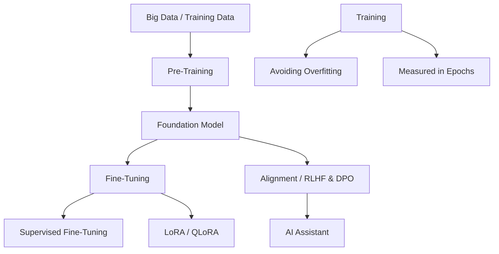
**Sources:** [webconsulting](https://www.webconsulting.at/blog/ki-kompendium-business-bildung-2025), [SwissMed AI](https://mdai.ch/blog/von-llm-bis-halluzination/), [DIN](https://www.din.de/resource/blob/772610/e96445ca1cbb372071981604ca9f07a2/normungsroadmap-ki-data.pdf)

| Term (EN) | Begriff (DE) | Explanation | Context | Source |
|---|---|---|---|---|
| Pre-training | Pre-Training | The "school years": training on trillions of texts to build world knowledge. | Produces a foundation model. | [1](https://www.webconsulting.at/blog/ki-kompendium-business-bildung-2025) |
| Fine-tuning | Feinabstimmung | The "vocational training": adapting a model to specialized tasks (e.g. medicine). | A step after pre-training. | [1](https://mdai.ch/blog/von-llm-bis-halluzination/), [2](https://www.webconsulting.at/blog/ki-kompendium-business-bildung-2025) |
| Supervised Learning | Ueberwachtes Lernen | Learning from labeled examples (input plus the correct output). | The most common ML method. | [1](https://www.ki.nrw/ki-schluesselbegriffe/), [2](https://www.webconsulting.at/blog/ki-kompendium-business-bildung-2025) |
| Unsupervised Learning | Unueberwachtes Lernen | The system searches for patterns on its own, without labels. | Used for clustering. | [1](https://www.ki.nrw/ki-schluesselbegriffe/), [2](https://www.webconsulting.at/blog/ki-kompendium-business-bildung-2025) |
| Reinforcement Learning (RL) | Bestaerkendes Lernen | Learning through reward and punishment (feedback) in an environment. | Important for games and robotics. | [1](https://www.ki.nrw/ki-schluesselbegriffe/), [2](https://www.webconsulting.at/blog/ki-kompendium-business-bildung-2025) |
| Reinforcement Learning (RL) | Verstärkendes Lernen | A learning process in which an agent learns optimal strategies through rewards within a rule system. | Used to teach AI systems to reach complex goals (e.g. games or autonomous navigation). | – |
| Overfitting | Überanpassung | A state where a model learns the training data so precisely that it no longer recognizes new patterns. | Makes the AI perform perfectly on known data but fail completely on new tasks. | [1](https://digitalzentrum-berlin.de/blog/ki-glossar) |
| Data Augmentation | Datenerweiterung | A process that generates new training data from existing data to improve performance. | Helps models become more robust and accurate by artificially increasing example variety. | – |
| Direct Preference Optimization | DPO | A more modern alignment method that needs no separate reward model. | An alternative to PPO in training. | [1](https://www.webconsulting.at/blog/ki-kompendium-business-bildung-2025) |
| Low-Rank Adaptation | LoRA | Efficient fine-tuning in which only tiny parts of the model are changed. | Saves 99% of the compute resources. | [1](https://www.webconsulting.at/blog/ki-kompendium-business-bildung-2025), [2](https://digitaleneuordnung.de/blog/ki-begriffe) |
| QLoRA | QLoRA | A combination of LoRA and quantization for the most resource-efficient training. | Makes training possible on normal PCs. | [1](https://www.webconsulting.at/blog/ki-kompendium-business-bildung-2025) |
| Epoch | Epoch | One complete pass through the entire training dataset. | A parameter for training duration. | [1](https://www.webconsulting.at/blog/ki-kompendium-business-bildung-2025), [2](https://www.din.de/resource/blob/772610/e96445ca1cbb372071981604ca9f07a2/normungsroadmap-ki-data.pdf) |
| Overfitting | Overfitting | The AI memorizes the data instead of understanding patterns (fails on anything new). | A common training error. | [1](https://www.webconsulting.at/blog/ki-kompendium-business-bildung-2025) |
| Catastrophic Forgetting | Catastrophic Forgetting | The AI forgets old knowledge when trained on a new task. | A problem with continual learning. | [1](https://www.webconsulting.at/blog/ki-kompendium-business-bildung-2025) |
| Zero-shot Learning | Zero-Shot Learning | The AI solves a task with no prior example, from the instruction alone. | Shows the model's ability to generalize. | [1](https://www.webconsulting.at/blog/ki-kompendium-business-bildung-2025), [2](https://digitaleneuordnung.de/blog/ki-begriffe) |
| Few-shot Learning | Few-Shot Learning | The AI is given 2–10 examples in the prompt to learn a pattern. | A method of in-context learning. | [1](https://www.webconsulting.at/blog/ki-kompendium-business-bildung-2025), [2](https://digitaleneuordnung.de/blog/ki-begriffe) |
| Synthetic Data | Synthetische Daten | Data artificially generated by AI to train other AI systems. | A solution when real data is scarce. | [1](https://www.webconsulting.at/blog/ki-kompendium-business-bildung-2025), [2](https://digitaleneuordnung.de/blog/ki-begriffe) |
| Scaling Laws | Scaling Laws | The rule that more data and compute almost always lead to better AI. | The reason for enormous investments. | [1](https://www.webconsulting.at/blog/ki-kompendium-business-bildung-2025) |
| Chinchilla Optimality | Chinchilla-Optimum | The finding that the optimal ratio is about 20 tokens per parameter. | Determines efficient model size. | [1](https://www.webconsulting.at/blog/ki-kompendium-business-bildung-2025) |

## 4. Prompting & Agents

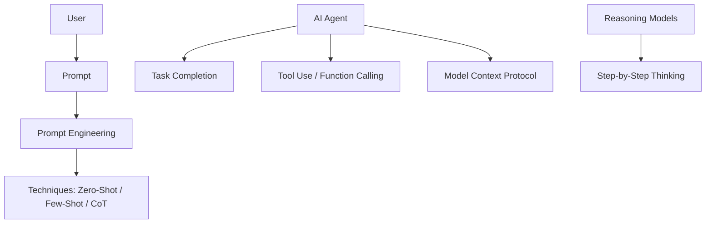
**Sources:** [Digital Neuordnung](https://digitaleneuordnung.de/blog/ki-begriffe), [Felicia Simon](https://www.youtube.com/watch?v=KI-Lernen), [webconsulting](https://www.webconsulting.at/blog/ki-kompendium-business-bildung-2025)

| Term (EN) | Begriff (DE) | Explanation | Context | Source |
|---|---|---|---|---|
| Prompt | Eingabeaufforderung | The instruction or question a human gives to the AI. | The interface to the user. | [1](https://digitaleneuordnung.de/blog/ki-begriffe), [2](https://www.youtube.com/watch?v=KI-Lernen) |
| Prompt Engineering | Prompt Engineering | The art of phrasing instructions precisely enough that the AI delivers an optimal result. | An important skill for users. | [1](https://www.webconsulting.at/blog/ki-kompendium-business-bildung-2025), [2](https://digitaleneuordnung.de/blog/ki-begriffe) |
| System Prompt | System Prompt | A hidden base instruction that sets the AI's role and rules (e.g. "be a teacher"). | Defines the bot's behavior. | [1](https://www.webconsulting.at/blog/ki-kompendium-business-bildung-2025) |
| Chain-of-Thought (CoT) | Chain-of-Thought | A technique that instructs the AI to think "step by step". | Massively improves logical reasoning. | [1](https://www.zendesk.de/blog/ai/generative-ai-glossary/), [2](https://www.webconsulting.at/blog/ki-kompendium-business-bildung-2025), [3](https://digitaleneuordnung.de/blog/ki-begriffe) |
| Reasoning | Reasoning | An AI's ability to draw logical conclusions and work through problems. | A hallmark of newer models (o1). | [1](https://digitaleneuordnung.de/blog/ki-begriffe), [2](https://www.youtube.com/watch?v=KI-Lernen) |
| AI Agent | KI-Agent | An autonomous system that completes tasks on its own (e.g. booking a trip). | The next step beyond chatbots. | [1](https://www.webconsulting.at/blog/ki-kompendium-business-bildung-2025), [2](https://digitaleneuordnung.de/blog/ki-begriffe) |
| AgentOps | AgentOps | The deployment, monitoring, and management of AI agents. | Infrastructure for agents. | [1](https://digitaleneuordnung.de/blog/ki-begriffe) |
| Model Context Protocol | MCP | An open standard for connecting AI models to data sources easily. | The "USB-C port" for AI data. | [1](https://digitaleneuordnung.de/blog/ki-begriffe), [2](https://www.youtube.com/watch?v=KI-Lernen) |
| Vibecoding | Vibecoding | Building apps by describing them, rather than writing code. | A new trend in software development. | [1](https://www.youtube.com/watch?v=KI-Lernen) |
| Multimodality | Multimodalitaet | The ability to process different data types (image, text, audio) at the same time. | A property of modern models. | [1](https://www.webconsulting.at/blog/ki-kompendium-business-bildung-2025), [2](https://www.youtube.com/watch?v=KI-Lernen) |
| Prompt Injection | Prompt Injection | An attack in which users bypass safety rules through tricks. | A security risk with LLMs. | [1](https://www.webconsulting.at/blog/ki-kompendium-business-bildung-2025), [2](https://digitaleneuordnung.de/blog/ki-begriffe) |
| Multi-Turn Conversation | Mehrstufiger Dialog | An AI's ability to hold a real conversation across several messages while keeping context. | The prerequisite for fluid conversations that refer back to earlier statements. | [1](https://joerg-loehr.com/ki-glossar) |

## 5. Computer Vision & Robotics

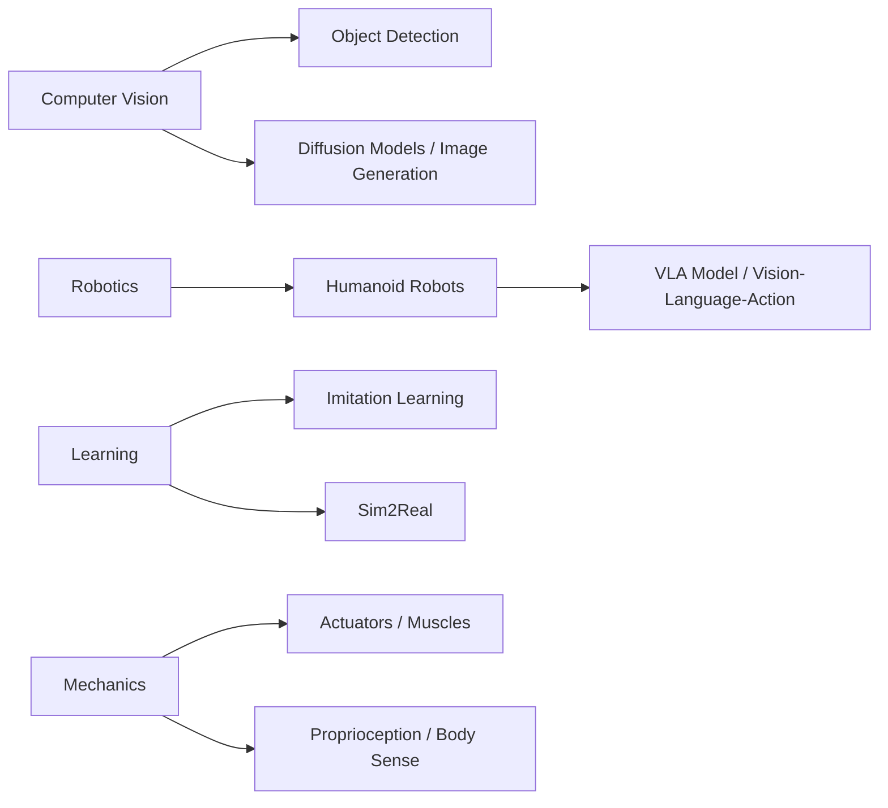
**Sources:** [webconsulting](https://www.webconsulting.at/blog/ki-kompendium-business-bildung-2025), [Digital Neuordnung](https://digitaleneuordnung.de/blog/ki-begriffe), [Canada.ca](https://our-languages.canada.ca/en/artificial-intelligence-terminology-concept-map-eng)

| Term (EN) | Begriff (DE) | Explanation | Context | Source |
|---|---|---|---|---|
| Computer Vision | Computer Vision | A computer's ability to "see" and understand images and video. | Used for autonomous driving. | [1](https://digitalzentrum-berlin.de/blog/ki-glossar), [2](https://www.ki.nrw/ki-schluesselbegriffe/), [3](https://digitaleneuordnung.de/blog/ki-begriffe) |
| Object Detection | Objekterkennung | Identifying and locating objects within an image. | A subtask of computer vision. | [1](https://our-languages.canada.ca/en/artificial-intelligence-terminology-concept-map-eng) |
| Diffusion Models | Diffusionsmodelle | AI models that generate images through a step-by-step "denoising" process. | The basis for Midjourney/DALL-E. | [1](https://www.webconsulting.at/blog/ki-kompendium-business-bildung-2025) |
| Humanoid Robot | Humanoider Roboter | A robot with a human-like form (two legs, two arms). | Goal: to use infrastructure built for humans. | [1](https://www.webconsulting.at/blog/ki-kompendium-business-bildung-2025) |
| Vision-Language-Action | VLA-Modell | A model that sees, understands language, and directly controls movement. | The "brain" for general-purpose robots. | [1](https://www.webconsulting.at/blog/ki-kompendium-business-bildung-2025) |
| Actuators | Aktuatoren | A robot's "muscles" (motors) that turn commands into motion. | A core hardware component. | [1](https://www.webconsulting.at/blog/ki-kompendium-business-bildung-2025) |
| Proprioception | Propriozeption | A robot's "body sense" (knowing where its joints are). | The basis for coordinated movement. | [1](https://www.webconsulting.at/blog/ki-kompendium-business-bildung-2025) |
| Imitation Learning | Imitation Learning | A robot learns by observing and imitating humans. | Faster than pure trial and error. | [1](https://www.webconsulting.at/blog/ki-kompendium-business-bildung-2025) |
| Sim2Real | Sim2Real | Transferring skills learned in a computer simulation into the real world. | Enables millions of practice hours. | [1](https://www.webconsulting.at/blog/ki-kompendium-business-bildung-2025) |
| Moravec's Paradox | Moravec-Paradox | The finding that what is hard for us (chess) is easy for AI, and vice versa. | Explains why progress in robotics is slow. | [1](https://www.webconsulting.at/blog/ki-kompendium-business-bildung-2025) |
| Robotics | Robotik | A branch of AI that develops machines that physically interact with the real world. | Combines computer vision and machine learning so machines can act autonomously. | [1](https://joerg-loehr.com/ki-glossar) |
| Physical AI | Physische KI | The stage at which software intelligence and hardware motor skills fully merge. | Lets robots perform real-world tasks autonomously and safely. | [1](https://joerg-loehr.com/ki-glossar) |
| Cobots | Kollaborative Roboter | AI-controlled robots designed specifically to work directly alongside humans. | Unlike isolated industrial robots, these are meant to share the same workspace. | – |
| Facial Recognition | Gesichtserkennung | A computer-vision technology that identifies and verifies faces in images or video. | Used in security systems, smartphones, and social media. | [1](https://digitalzentrum-berlin.de/blog/ki-glossar) |

## 6. Security, Ethics & Law

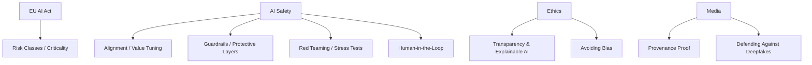
**Sources:** [DIN](https://www.din.de/resource/blob/772610/e96445ca1cbb372071981604ca9f07a2/normungsroadmap-ki-data.pdf), [webconsulting](https://www.webconsulting.at/blog/ki-kompendium-business-bildung-2025), [SwissMed AI](https://mdai.ch/blog/von-llm-bis-halluzination/), [KI.NRW](https://www.ki.nrw/ki-schluesselbegriffe/)

| Term (EN) | Begriff (DE) | Explanation | Context | Source |
|---|---|---|---|---|
| EU AI Act | EU AI Act | The world's first law to regulate AI by risk class. | The legal framework in Europe. | [1](https://oth-aw.de/ki-strategie), [2](https://www.ki.nrw/ki-schluesselbegriffe/), [3](https://www.webconsulting.at/blog/ki-kompendium-business-bildung-2025) |
| Criticality | Kritikalitaet | A measure of the potential harm an AI application could cause. | The basis for risk-adapted regulation. | [1](https://www.din.de/resource/blob/772610/e96445ca1cbb372071981604ca9f07a2/normungsroadmap-ki-data.pdf) |
| Alignment | Alignment | Ensuring that an AI's goals match human values. | A central safety problem. | [1](https://www.webconsulting.at/blog/ki-kompendium-business-bildung-2025) |
| P(doom) | P(doom) | The estimated probability of an existential catastrophe caused by AI. | A subject of debate over AI risk. | [1](https://www.webconsulting.at/blog/ki-kompendium-business-bildung-2025) |
| Constitutional AI | Constitutional AI | AI trains itself for safety against a "constitution" (a set of rules). | Anthropic's (Claude's) approach. | [1](https://www.webconsulting.at/blog/ki-kompendium-business-bildung-2025) |
| Red Teaming | Red Teaming | Targeted expert attacks aimed at finding security flaws in AI systems. | Part of quality assurance. | [1](https://www.webconsulting.at/blog/ki-kompendium-business-bildung-2025) |
| Guardrails | Guardrails | Safety filters that prevent an AI from producing dangerous output. | A protective layer for AI apps. | [1](https://www.webconsulting.at/blog/ki-kompendium-business-bildung-2025) |
| Human-in-the-Loop | Human-in-the-Loop | A human must review AI results before they are used. | A safety concept; a human stays in the loop. | [1](https://mdai.ch/blog/von-llm-bis-halluzination/), [2](https://www.din.de/resource/blob/772610/e96445ca1cbb372071981604ca9f07a2/normungsroadmap-ki-data.pdf) |
| Bias | Bias | Systematic errors or discrimination caused by one-sided data. | A fairness problem. | [1](https://mdai.ch/blog/von-llm-bis-halluzination/), [2](https://joerg-loehr.com/ki-glossar), [3](https://www.webconsulting.at/blog/ki-kompendium-business-bildung-2025) |
| Explainable AI (XAI) | Erklaerbare KI | Methods that make the decisions of "black box" models understandable. | Needed for trust and traceability. | [1](https://www.ki.nrw/ki-schluesselbegriffe/) |
| Deepfake | Deepfakes | AI-generated media that convincingly imitates real people. | A risk for disinformation. | [1](https://www.webconsulting.at/blog/ki-kompendium-business-bildung-2025) |
| C2PA | C2PA | A technical standard for digital provenance proof in images. | A tool in the fight against deepfakes. | [1](https://www.webconsulting.at/blog/ki-kompendium-business-bildung-2025) |
| Model Drift | Model Drift | The decline in an AI's performance as the real world changes after training. | A problem during ongoing operation. | [1](https://mdai.ch/blog/von-llm-bis-halluzination/) |
| AI Governance | KI-Governance | A binding set of rules (mandates, approvals, controls) for AI use within a company. | Guarantees legally sound and ethical use of AI models. | – |
| AI Literacy | KI-Kompetenz | A person's ability to understand AI systems, their risks and limits, and use them responsibly. | Explicitly required as a training obligation for organizations under the EU AI Act. | [1](https://joerg-loehr.com/ki-glossar) |

## 7. Industry & Medicine

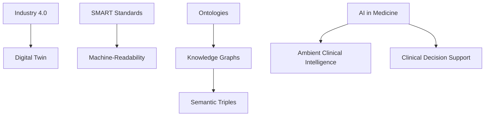
**Sources:** [DIN](https://www.din.de/resource/blob/772610/e96445ca1cbb372071981604ca9f07a2/normungsroadmap-ki-data.pdf), [SwissMed AI](https://mdai.ch/blog/von-llm-bis-halluzination/)

| Term (EN) | Begriff (DE) | Explanation | Context | Source |
|---|---|---|---|---|
| Industry 4.0 | Industrie 4.0 | The networking of production through AI and the Internet of Things (IoT). | The framework for industrial AI. | [1](https://www.din.de/resource/blob/772610/e96445ca1cbb372071981604ca9f07a2/normungsroadmap-ki-data.pdf) |
| Digital Twin | Digitaler Zwilling | A virtual copy of an object used for real-time simulations. | Used to optimize production. | [1](https://www.din.de/resource/blob/772610/e96445ca1cbb372071981604ca9f07a2/normungsroadmap-ki-data.pdf) |
| SMART Standards | SMART Standards | Standards that are directly machine-readable and executable by AI systems. | The future of standardization. | [1](https://www.din.de/resource/blob/772610/e96445ca1cbb372071981604ca9f07a2/normungsroadmap-ki-data.pdf) |
| Ontology | Ontologie | A formal description of the terms and logic of a subject area. | Enables machine-readable language. | [1](https://www.din.de/resource/blob/772610/e96445ca1cbb372071981604ca9f07a2/normungsroadmap-ki-data.pdf) |
| Semantic Triple | Semantisches Tripel | A fact in the form subject-predicate-object (e.g. "A works at B"). | The basis for knowledge graphs. | [1](https://www.din.de/resource/blob/772610/e96445ca1cbb372071981604ca9f07a2/normungsroadmap-ki-data.pdf) |
| Ambient Clinical Intelligence | ACI | AI that automatically documents doctor-patient conversations. | An application in medicine. | [1](https://mdai.ch/blog/von-llm-bis-halluzination/) |
| Clinical Decision Support Systems | CDSS | Systems that give doctors medical recommendations. | Clinical support systems. | [1](https://mdai.ch/blog/von-llm-bis-halluzination/) |
| Predictive Maintenance | Vorausschauende Wartung | The use of AI to monitor equipment condition and predict maintenance needs. | Helps industry minimize downtime and extend the life of machines. | – |
| Robotic Process Automation (RPA) | Robotische Prozessautomatisierung | Software robots that automate structured, repetitive digital tasks on a PC. | Frees staff from monotonous clicking tasks in admin or customer support. | – |
| Cognitive Computing | Kognitives Computing | A technology that simulates human thinking to deliver personalized recommendations. | Offers improved functionality and adaptability in areas like finance or HR. | – |
| AI Bill of Materials (AI BoM) | KI-Stückliste | A structured list that identifies all AI-related components and dependencies in a pipeline. | Provides transparency and security about exactly which models and data were used. | – |

## 8. Hardware & Metrics

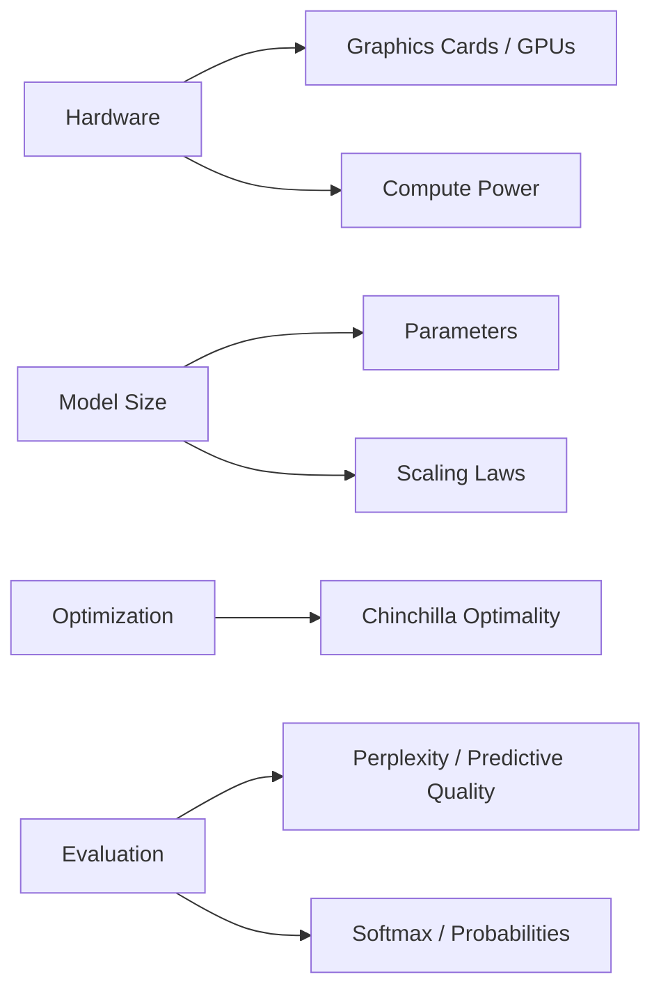
**Sources:** [webconsulting](https://www.webconsulting.at/blog/ki-kompendium-business-bildung-2025), [DIN](https://www.din.de/resource/blob/772610/e96445ca1cbb372071981604ca9f07a2/normungsroadmap-ki-data.pdf)

| Term (EN) | Begriff (DE) | Explanation | Context | Source |
|---|---|---|---|---|
| Parameter | Parameter | The "dials" inside a model that store what it has learned. | Determine model size and capability. | [1](https://www.webconsulting.at/blog/ki-kompendium-business-bildung-2025), [2](https://www.din.de/resource/blob/772610/e96445ca1cbb372071981604ca9f07a2/normungsroadmap-ki-data.pdf) |
| Graphics Processing Unit | GPU / Grafikkarte | Specialized chips ideal for parallel AI computation. | The hardware basis of the AI boom. | [1](https://www.webconsulting.at/blog/ki-kompendium-business-bildung-2025) |
| Perplexity | Perplexity | A measure of how good a model's predictions are (lower is better). | A metric for model evaluation. | [1](https://www.webconsulting.at/blog/ki-kompendium-business-bildung-2025) |
| Big Data | Big Data | Enormous volumes of data, too complex for normal programs. | The fuel for AI training. | [1](https://www.ki.nrw/ki-schluesselbegriffe/), [2](https://www.coursera.org/de-DE/articles/ai-vs-deep-learning-vs-machine-learning-beginners-guide) |
| Context Window | Kontextfenster | The amount of information an AI can process at once during an interaction. | Determines how long a document can be while the AI still keeps all details in "memory". | [1](https://www.zendesk.de/blog/ai/generative-ai-glossary/) |
| Scalability | Skalierbarkeit | An AI system's ability to stay stable and efficient as user numbers grow massively. | Critical for a company-wide rollout of AI solutions without loss of performance. | [1](https://joerg-loehr.com/ki-glossar) |
| Edge AI | Edge-KI | A form of AI processing that runs directly on the local device (e.g. a phone). | Reduces latency and improves privacy, since no data has to be sent to the cloud. | – |

## Visual Overview Diagrams

These diagrams show the technical data flows, architectures and frameworks behind the terms above (carried over from the original wiki glossary, generated with NotebookLM on 2026-08-05).

### The Technical Pipeline (From Token to Inference)
This diagram visualizes the "forward pass" inside a Transformer, including optimizations such as **Flash Attention** and **MoE**.

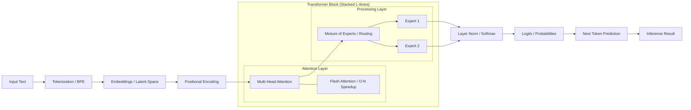
**Sources:** [webconsulting](https://www.webconsulting.at/blog/ki-kompendium-business-bildung-2025), [dno](https://digitaleneuordnung.de/blog/ki-begriffe) [2.2, 2.18, 2.20, 4.9, 4.10]

### The Model Lifecycle (Training, Alignment & Optimization)
A visualization of a model's evolution from raw data to a specialized, aligned assistant, using **LoRA** and **DPO**.

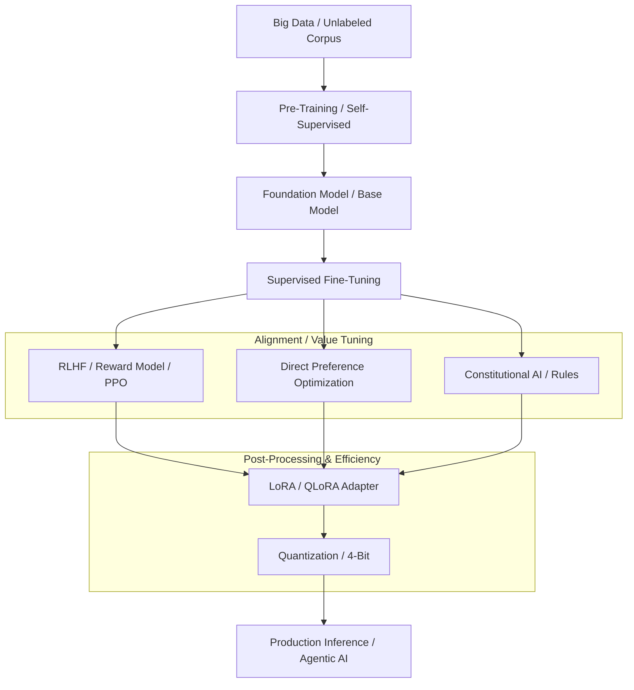
**Sources:** [webconsulting](https://www.webconsulting.at/blog/ki-kompendium-business-bildung-2025), [Coursera](https://www.coursera.org/de-DE/articles/ai-vs-deep-learning-vs-machine-learning-beginners-guide) [1.8, 3.3, 3.5, 3.6, 6.5]

### Risk & Compliance Framework (EU AI Act & NIST)
A hierarchical model for classifying systems by **criticality** and the protective layers (**guardrails**) they require.

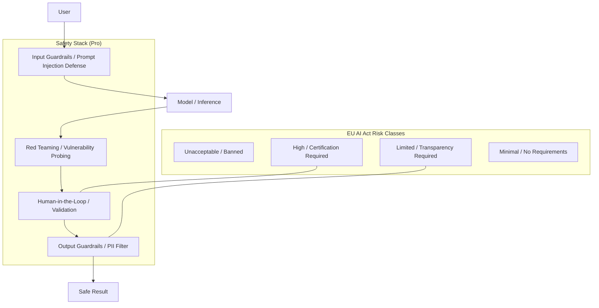
**Sources:** [DIN](https://www.din.de/resource/blob/772610/e96445ca1cbb372071981604ca9f07a2/normungsroadmap-ki-data.pdf), [webconsulting](https://www.webconsulting.at/blog/ki-kompendium-business-bildung-2025), [SwissMed AI](https://mdai.ch/blog/von-llm-bis-halluzination/) [6.1, 4.13, 6.6, 6.9, 619]

### EU AI Act: The Four Risk Classes
This diagram visualizes the regulatory tiers of the EU AI Act.

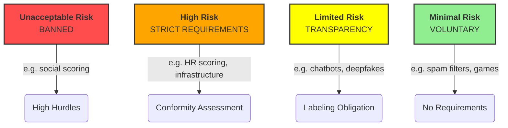

### How Proactive AI Agents Work
This infographic illustrates the shift from reactive chatbot to proactive agent. It shows the so-called agent loop: a human sets a goal, and the agent then plans autonomously, uses external tools (such as APIs or web search), and continuously evaluates its actions in a loop of observing, thinking, and acting until the goal is reached.

### Agentic AI & Reasoning (Loop Architecture)
This diagram shows how **reasoning models** (such as o1) use external protocols (**MCP**) and tools (**function calling**) to act autonomously.

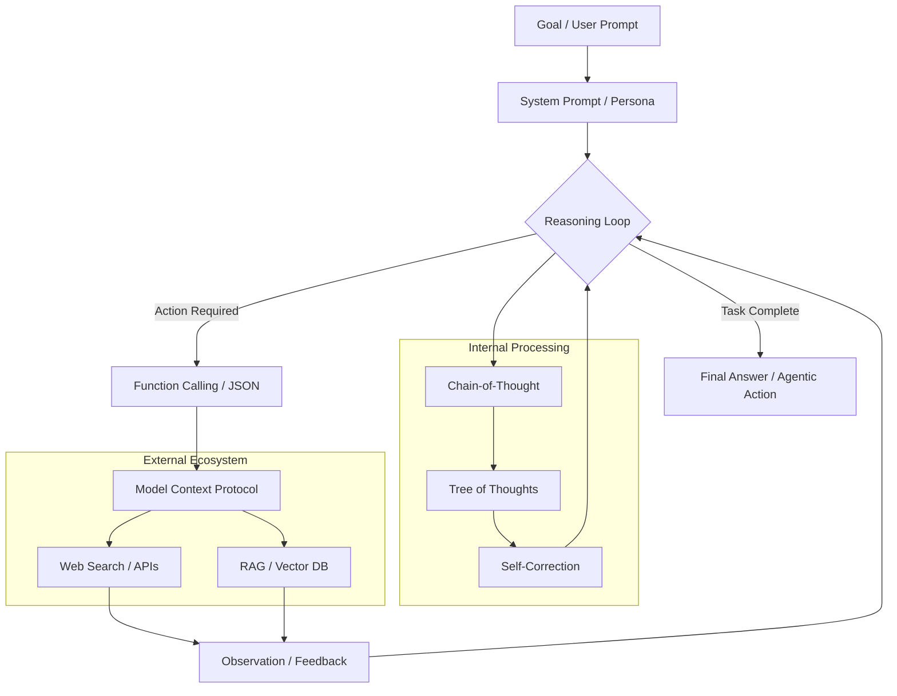
**Sources:** [dno](https://digitaleneuordnung.de/blog/ki-begriffe), [Felicia Simon](https://www.youtube.com/watch?v=KI-Lernen) [3.13, 3.51, 4.6, 4.7, 613]

### Advanced RAG & Knowledge Modeling
The connection between unstructured data (chunks) and structured standards (**SMART Standards**) and **knowledge graphs**.

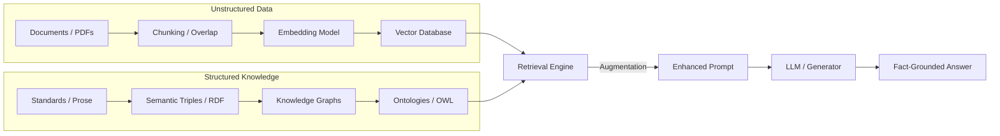
**Sources:** [DIN](https://www.din.de/resource/blob/772610/e96445ca1cbb372071981604ca9f07a2/normungsroadmap-ki-data.pdf), [webconsulting](https://www.webconsulting.at/blog/ki-kompendium-business-bildung-2025) [4.1, 4.3, 4.4, 4.5, 308, 324]

### RAG: The "Open-Book" Principle
The graphic shows the three-step process by which an AI does not just answer from memory ("closed-book"), but instead looks things up in an external knowledge base (e.g. a vector database) like a detective ("open-book").

### Comparison: Fine-Tuning vs. RAG
This diagram shows the difference between changing the model's "brain" (weights) and using a "cheat sheet" (context).

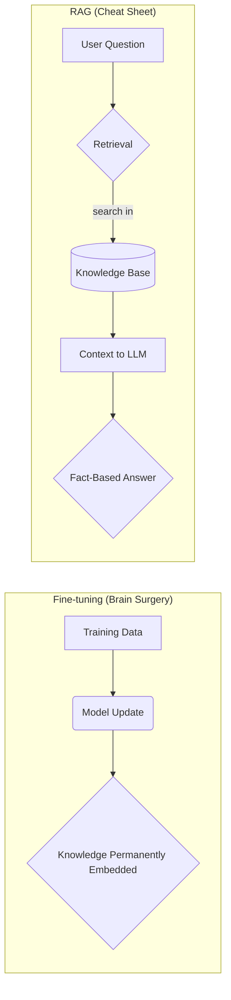

### AI Bill of Materials (AI BoM)
A visualization of an AI system's components for transparency and governance.

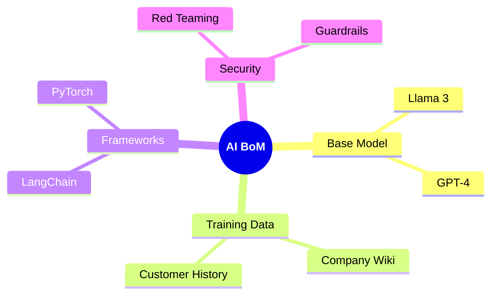

### Chain of Thought
Shows the step-by-step reasoning process that improves accuracy on complex tasks.

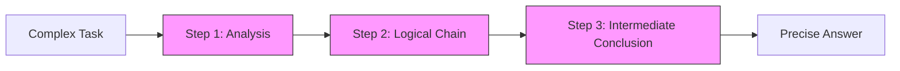

### The Knowledge Pyramid (DIKW)
Visualizes the path from raw data to strategic AI actions.

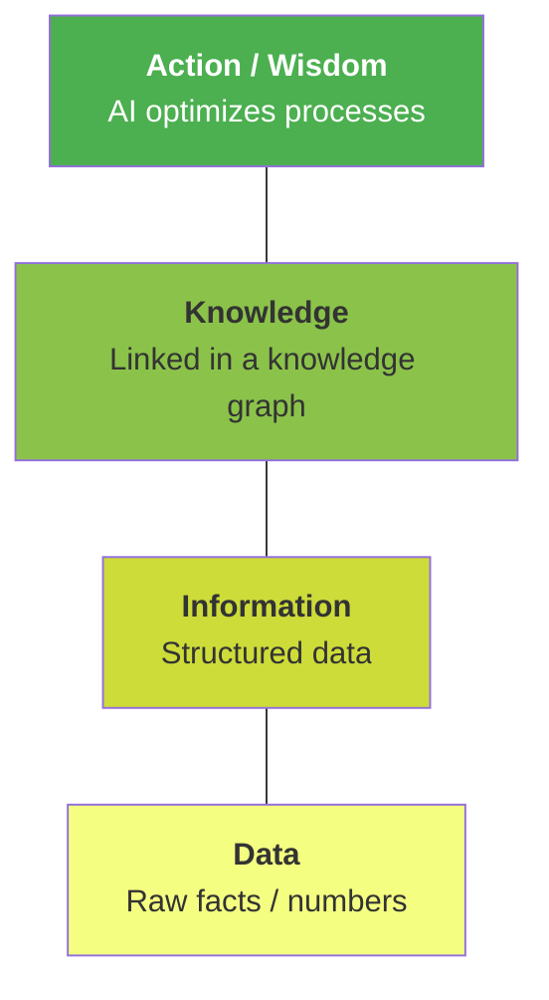

### Vibe Coding vs. Traditional Coding
A comparison of the iterative, AI-assisted flow versus classic software development.

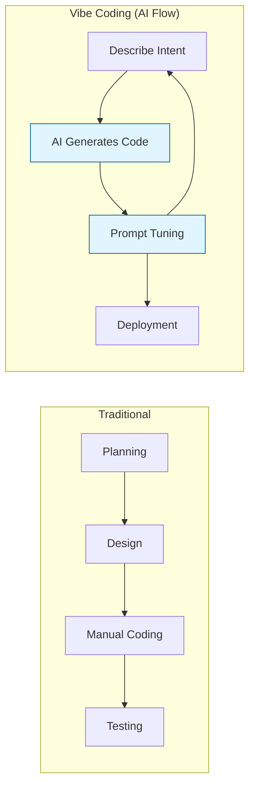
