# KI-Glossar

Generiert aus glossary/terms.yaml – Stand 2026-09-04.  
Änderungen bitte per PR im Repo, nicht direkt im Wiki.

## 1. Grundlagen & Kernkonzepte

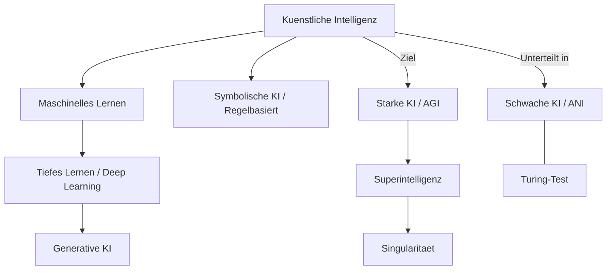
**Quellen:** [Moterra](https://moterra.com/ai-map-simplified-understanding-ai-ml-dl-and-genai/), [DIN](https://www.din.de/resource/blob/772610/e96445ca1cbb372071981604ca9f07a2/normungsroadmap-ki-data.pdf), [Coursera](https://www.coursera.org/de-DE/articles/ai-vs-deep-learning-vs-machine-learning-beginners-guide), [webconsulting](https://www.webconsulting.at/blog/ki-kompendium-business-bildung-2025)

| Begriff (DE) | Term (EN) | Erklärung | Zusammenhang | Quelle |
|---|---|---|---|---|
| Kuenstliche Intelligenz | Artificial Intelligence (AI) | Computersysteme, die menschliche Faehigkeiten wie Sehen, Sprechen oder Entscheiden nachahmen. | Der umfassende Oberbegriff. | [1](https://moterra.ai/blog/ai-map-simplified-understanding-ai-ml-dl-and-genai), [2](https://www.din.de/resource/blob/772610/e96445ca1cbb372071981604ca9f07a2/normungsroadmap-ki-data.pdf) |
| Maschinelles Lernen | Machine Learning (ML) | Systeme lernen automatisch aus Mustern in Daten, statt explizit programmiert zu werden. | Teilmenge der KI. | [1](https://www.ki.nrw/ki-schluesselbegriffe/), [2](https://www.coursera.org/de-DE/articles/ai-vs-deep-learning-vs-machine-learning-beginners-guide) |
| Tiefes Lernen | Deep Learning (DL) | ML mit kuenstlichen neuronalen Netzen, die viele Schichten („tief“) besitzen. | Teilmenge von ML. | [1](https://www.coursera.org/de-DE/articles/ai-vs-deep-learning-vs-machine-learning-beginners-guide), [2](https://www.ibm.com/topics/deep-learning) |
| Generative KI | Generative AI (GenAI) | Eine Form der KI, die neue Inhalte (Texte, Bilder, Musik, Code) erschaft. | Teilbereich der KI. | [1](https://www.webconsulting.at/blog/ki-kompendium-business-bildung-2025), [2](https://digitaleneuordnung.de/blog/ki-begriffe) |
| Starke KI | General AI (AGI) | Eine theoretische KI, die jede kognitive Aufgabe so gut wie ein Mensch loesen kann. | Fernziel der Forschung. | [1](https://www.webconsulting.at/blog/ki-kompendium-business-bildung-2025), [2](https://our-languages.canada.ca/en/artificial-intelligence-terminology-concept-map-eng) |
| Schwache KI | Narrow AI (ANI) | KI, die fuer eine ganz spezifische Aufgabe (z.B. Schach) optimiert ist. | Fast alle heutigen Systeme. | [1](https://www.webconsulting.at/blog/ki-kompendium-business-bildung-2025), [2](https://www.din.de/resource/blob/772610/e96445ca1cbb372071981604ca9f07a2/normungsroadmap-ki-data.pdf) |
| Superintelligenz | Superintelligence (ASI) | Eine KI, die die menschliche Intelligenz in allen Bereichen weit uebertrifft. | Folgt theoretisch auf die AGI. | [1](https://www.webconsulting.at/blog/ki-kompendium-business-bildung-2025) |
| Singularitaet | Singularity | Zeitpunkt, ab dem KI sich so schnell selbst verbessert, dass Menschen nicht mehr folgen koennen. | Zukunftsszenario (ca. 2045). | [1](https://www.webconsulting.at/blog/ki-kompendium-business-bildung-2025) |
| Turing-Test | Turing Test | Ein Test von 1950: Kann eine KI im Chat so tun, als sei sie ein Mensch?. | Historischer Masstab fuer Intelligenz. | [1](https://www.ki.nrw/ki-schluesselbegriffe/), [2](https://www.webconsulting.at/blog/ki-kompendium-business-bildung-2025) |
| Algorithmus | Algorithm | Eine genaue Schritt-fuer-Schritt-Vorschrift zur Loesung einer Aufgabe. | Mathematische Basis jeder Software. | [1](https://www.ki.nrw/ki-schluesselbegriffe/), [2](https://www.din.de/resource/blob/772610/e96445ca1cbb372071981604ca9f07a2/normungsroadmap-ki-data.pdf) |
| Künstliche allgemeine Intelligenz | Artificial General Intelligence (AGI) | Eine theoretische KI, die jede intellektuelle Aufgabe eines Menschen in allen Bereichen erfüllen kann. | Gilt als "heiliger Gral" der KI-Forschung; existiert zum heutigen Stand noch nicht. | [1](https://www.zendesk.de/blog/ai/generative-ai-glossary/) |

## 2. Technik, Architektur & NLP

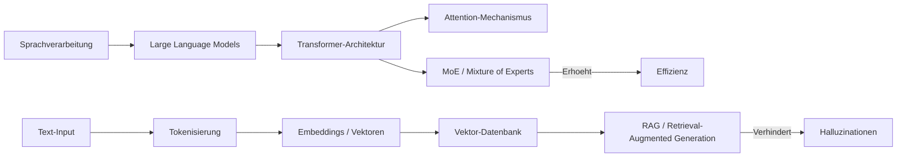

| Begriff (DE) | Term (EN) | Erklärung | Zusammenhang | Quelle |
|---|---|---|---|---|
| Basismodell | Foundation Model | Massiv trainierte Modelle, die als breite technologische Basis für viele verschiedene Anwendungen dienen. | Ermöglicht es, ein einzelnes Modell (z. B. GPT-4) für hunderte verschiedene Aufgaben einzusetzen. | [1](https://joerg-loehr.com/ki-glossar) |
| Grosses Sprachmodell | Large Language Model (LLM) | Ein riesiges neuronales Netz, das darauf trainiert wurde, Sprache zu verstehen und zu erzeugen. | Basis fuer ChatGPT, Claude etc.. | [1](https://mdai.ch/blog/von-llm-bis-halluzination/), [2](https://www.webconsulting.at/blog/ki-kompendium-business-bildung-2025) |
| Sprachverarbeitung | Natural Language Processing (NLP) | Ein KI-Feld, das Computern hilft, menschliche Sprache zu verstehen, zu interpretieren und zu erzeugen. | Ermöglicht Funktionen wie Textklassifizierung, Stimmungsanalyse und automatisierte Übersetzung. | [1](https://www.zendesk.de/blog/ai/generative-ai-glossary/) |
| Wissensgraph | Knowledge Graph | Eine semantische Netzwerkstruktur, die Informationen und deren Beziehungen grafisch darstellt. | Erlaubt es KI-Systemen, Informationen über Knoten (Entitäten) und Kanten (Beziehungen) logisch zu verknüpfen. | [1](https://ki-zentrum.ch/studien) |
| Transformer | Transformer | Die moderne Architektur, die paralleles Verarbeiten von Textzusammenhaengen erlaubt. | Das „T“ in GPT. | [1](https://www.ki.nrw/ki-schluesselbegriffe/), [2](https://www.webconsulting.at/blog/ki-kompendium-business-bildung-2025) |
| Attention-Mechanismus | Attention Mechanism | Erlaubt der KI, die wichtigsten Teile einer Eingabe staerker zu gewichten. | Kerninnovation des Transformers. | [1](https://www.webconsulting.at/blog/ki-kompendium-business-bildung-2025) |
| Token | Token | Die Basiseinheit (Wortteile oder Silben), in die Text fuer die KI zerlegt wird. | „Waehrung“ der KI-Verarbeitung. | [1](https://www.webconsulting.at/blog/ki-kompendium-business-bildung-2025), [2](https://digitaleneuordnung.de/blog/ki-begriffe) |
| Tokenisierung | Tokenization | Der Prozess der Zerlegung von Text in einzelne Tokens. | Erster Schritt der Textverarbeitung. | [1](https://www.webconsulting.at/blog/ki-kompendium-business-bildung-2025), [2](https://digitaleneuordnung.de/blog/ki-begriffe) |
| Embeddings | Embeddings | Umwandlung von Woertern in Zahlenreihen (Vektoren), um Bedeutung berechenbar zu machen. | Basis fuer semantische Suche. | [1](https://www.webconsulting.at/blog/ki-kompendium-business-bildung-2025), [2](https://digitaleneuordnung.de/blog/ki-begriffe) |
| RAG | Retrieval-Augmented Generation | Die KI sucht vor der Antwort in externen Quellen (z.B. Internet), um Fakten zu pruefen. | Methode gegen Halluzinationen. | [1](https://www.zendesk.de/blog/ai/generative-ai-glossary/), [2](https://www.webconsulting.at/blog/ki-kompendium-business-bildung-2025), [3](https://arxiv.org/abs/2005.11401) |
| Vektor-Datenbank | Vector Database | Spezialisierte Datenbank, die Inhalte nach Bedeutung statt nach Schlagworten findet. | Essenziell fuer RAG-Systeme. | [1](https://www.webconsulting.at/blog/ki-kompendium-business-bildung-2025), [2](https://digitaleneuordnung.de/blog/ki-begriffe) |
| Halluzination | Hallucination | Die KI behauptet selbstbewusst falsche Fakten oder erfindet Quellen. | Bekanntes Problem bei LLMs. | [1](https://mdai.ch/blog/von-llm-bis-halluzination/), [2](https://digitalzentrum-berlin.de/blog/ki-glossar), [3](https://www.webconsulting.at/blog/ki-kompendium-business-bildung-2025) |
| Kontext-Fenster | Context Window | Das „Kurzzeitgedaechtnis“ – wie viel Text die KI gleichzeitig verarbeiten kann. | Begrenzt die Laenge von PDFs/Chats. | [1](https://www.webconsulting.at/blog/ki-kompendium-business-bildung-2025), [2](https://www.zendesk.de/blog/ai/generative-ai-glossary/) |
| MoE / Sparse Models | Mixture of Experts (MoE) | Architektur, bei der nur spezialisierte Teile eines Modells pro Anfrage aktiv sind. | Macht riesige Modelle effizienter. | [1](https://www.webconsulting.at/blog/ki-kompendium-business-bildung-2025) |
| Inferenz | Inference | Die eigentliche Anwendung des fertigen Modells auf eine neue Frage. | Phase nach dem Training [1.10]. | [1](https://www.webconsulting.at/blog/ki-kompendium-business-bildung-2025), [2](https://www.din.de/resource/blob/772610/e96445ca1cbb372071981604ca9f07a2/normungsroadmap-ki-data.pdf) |
| Encoder | Encoder | Teil des Modells, der Input verarbeitet und Repraesentationen erstellt. | Teil der Transformer-Architektur. | [1](https://www.webconsulting.at/blog/ki-kompendium-business-bildung-2025) |
| Decoder | Decoder | Teil des Modells, der Output basierend auf Repraesentationen generiert. | GPT nutzt primuer den Decoder. | [1](https://www.webconsulting.at/blog/ki-kompendium-business-bildung-2025) |
| Softmax | Softmax | Mathematische Funktion, die Ausgaben in Wahrscheinlichkeiten umwandelt. | Letzter Schritt vor der Token-Wahl. | [1](https://www.webconsulting.at/blog/ki-kompendium-business-bildung-2025) |
| Beam Search | Beam Search | Algorithmus, der mehrere Textpfade parallel prueft, um das beste Ergebnis zu finden. | Methode zur Textgenerierung. | [1](https://www.webconsulting.at/blog/ki-kompendium-business-bildung-2025) |
| Latent Space | Latent Space | Hochdimensionaler Raum, in dem das Netz seine internen Konzepte speichert. | Geometrie der Semantik. | [1](https://www.webconsulting.at/blog/ki-kompendium-business-bildung-2025) |
| Flash Attention | Flash Attention | Ein technischer Trick, der die Attention-Berechnung massiv beschleunigt. | Ermoeglicht riesige Kontextfenster. | [1](https://www.webconsulting.at/blog/ki-kompendium-business-bildung-2025) |
| Prompt Caching | Prompt Caching | Technik, die wiederholt genutzte Prompt-Abschnitte zwischenspeichert, um Kosten und Latenz bei Folgeanfragen zu senken. | Wichtig fuer agentische Workflows mit langen, wiederkehrenden Kontexten. | [1](https://platform.claude.com/docs/en/build-with-claude/prompt-caching) |

## 3. Training, Anpassung & Daten

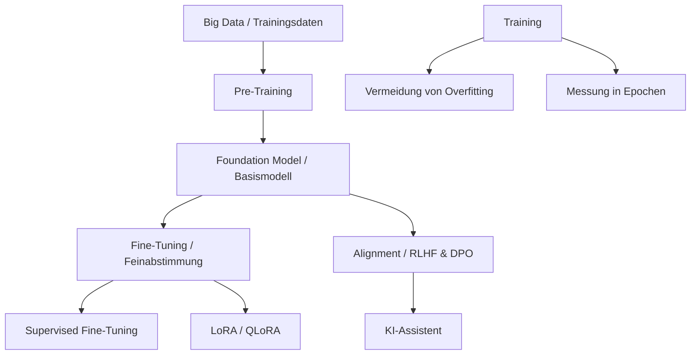
**Quellen:** [webconsulting](https://www.webconsulting.at/blog/ki-kompendium-business-bildung-2025), [SwissMed AI](https://mdai.ch/blog/von-llm-bis-halluzination/), [DIN](https://www.din.de/resource/blob/772610/e96445ca1cbb372071981604ca9f07a2/normungsroadmap-ki-data.pdf)

| Begriff (DE) | Term (EN) | Erklärung | Zusammenhang | Quelle |
|---|---|---|---|---|
| Pre-Training | Pre-training | Die „Schulzeit“: Training auf Billionen von Texten fuer Weltwissen. | Erzeugt ein Foundation Model. | [1](https://www.webconsulting.at/blog/ki-kompendium-business-bildung-2025) |
| Feinabstimmung | Fine-tuning | Die „Berufsausbildung“: Anpassung an Spezialaufgaben (z.B. Medizin). | Schritt nach dem Pre-Training. | [1](https://mdai.ch/blog/von-llm-bis-halluzination/), [2](https://www.webconsulting.at/blog/ki-kompendium-business-bildung-2025) |
| Ueberwachtes Lernen | Supervised Learning | Lernen mit gelabelten Beispielen (Eingabe + richtige Ausgabe). | Haeufigste ML-Methode. | [1](https://www.ki.nrw/ki-schluesselbegriffe/), [2](https://www.webconsulting.at/blog/ki-kompendium-business-bildung-2025) |
| Unueberwachtes Lernen | Unsupervised Learning | Das System sucht eigenstaendig nach Mustern ohne Vorgaben. | Genutzt fuer Clustering. | [1](https://www.ki.nrw/ki-schluesselbegriffe/), [2](https://www.webconsulting.at/blog/ki-kompendium-business-bildung-2025) |
| Bestärkendes Lernen | Reinforcement Learning (RL) | Ein Lernprozess, bei dem ein Agent durch Belohnungen innerhalb eines Regelsystems optimale Strategien lernt. | Wichtig fuer Spiele und Robotik, etwa um komplexe Ziele wie autonome Navigation zu erreichen. | [1](https://www.ki.nrw/ki-schluesselbegriffe/), [2](https://www.webconsulting.at/blog/ki-kompendium-business-bildung-2025) |
| Überanpassung | Overfitting | Ein Zustand, in dem ein Modell die Trainingsdaten so genau lernt, dass es keine neuen Muster mehr erkennt. | Führt dazu, dass die KI bei bekannten Daten perfekt arbeitet, aber bei neuen Aufgaben komplett versagt. | [1](https://digitalzentrum-berlin.de/blog/ki-glossar), [2](https://www.webconsulting.at/blog/ki-kompendium-business-bildung-2025) |
| Datenerweiterung | Data Augmentation | Ein Prozess zur Generierung neuer Trainingsdaten aus vorhandenen Daten zur Leistungssteigerung. | Hilft Modellen, robuster und genauer zu werden, indem die Vielfalt der Beispiele künstlich erhöht wird. | – |
| DPO | Direct Preference Optimization | Modernere Methode zum Alignment ohne separates Belohnungsmodell. | Alternative zu PPO im Training. | [1](https://www.webconsulting.at/blog/ki-kompendium-business-bildung-2025) |
| LoRA | Low-Rank Adaptation | Effizientes Fine-tuning, bei dem nur winzige Teile geaendert werden. | Spart 99% der Rechenressourcen. | [1](https://www.webconsulting.at/blog/ki-kompendium-business-bildung-2025), [2](https://digitaleneuordnung.de/blog/ki-begriffe) |
| QLoRA | QLoRA | Kombination aus LoRA und Quantisierung fuer sparsamstes Training. | Training auf normalen PCs moeglich. | [1](https://www.webconsulting.at/blog/ki-kompendium-business-bildung-2025) |
| Epoch | Epoch | Ein kompletter Durchlauf durch den gesamten Trainingsdatensatz. | Parameter fuer Trainingsdauer. | [1](https://www.webconsulting.at/blog/ki-kompendium-business-bildung-2025), [2](https://www.din.de/resource/blob/772610/e96445ca1cbb372071981604ca9f07a2/normungsroadmap-ki-data.pdf) |
| Catastrophic Forgetting | Catastrophic Forgetting | KI vergisst altes Wissen, wenn sie auf eine neue Aufgabe trainiert wird. | Problem beim kontinuierlichen Lernen. | [1](https://www.webconsulting.at/blog/ki-kompendium-business-bildung-2025) |
| Zero-Shot Learning | Zero-shot Learning | Die KI loest eine Aufgabe ohne vorheriges Beispiel, nur per Befehl. | Zeigt Generalisierungsfaehigkeit. | [1](https://www.webconsulting.at/blog/ki-kompendium-business-bildung-2025), [2](https://digitaleneuordnung.de/blog/ki-begriffe) |
| Few-Shot Learning | Few-shot Learning | Die KI bekommt 2–10 Beispiele im Prompt, um ein Muster zu verstehen. | Methode des In-Context Learning. | [1](https://www.webconsulting.at/blog/ki-kompendium-business-bildung-2025), [2](https://digitaleneuordnung.de/blog/ki-begriffe) |
| Synthetische Daten | Synthetic Data | Kuenstlich von KIs erzeugte Daten zum Training anderer KIs. | Loesung bei Datenknappheit. | [1](https://www.webconsulting.at/blog/ki-kompendium-business-bildung-2025), [2](https://digitaleneuordnung.de/blog/ki-begriffe) |
| Scaling Laws | Scaling Laws | Regel: Mehr Daten und Rechenkraft fuehren fast immer zu besserer KI. | Grund fuer enorme Investitionen. | [1](https://www.webconsulting.at/blog/ki-kompendium-business-bildung-2025) |
| Chinchilla-Optimum | Chinchilla Optimality | Erkenntnis: Das optimale Verhaeltnis ist 20 Tokens pro Parameter. | Bestimmt effiziente Modellgroesse. | [1](https://www.webconsulting.at/blog/ki-kompendium-business-bildung-2025) |

## 4. Prompting & Agenten

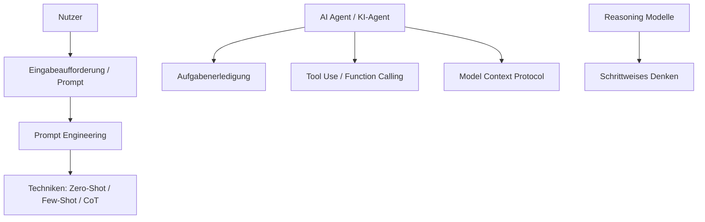
**Quellen:** [Digital Neuordnung](https://digitaleneuordnung.de/blog/ki-begriffe), [webconsulting](https://www.webconsulting.at/blog/ki-kompendium-business-bildung-2025)

| Begriff (DE) | Term (EN) | Erklärung | Zusammenhang | Quelle |
|---|---|---|---|---|
| Eingabeaufforderung | Prompt | Die Anweisung oder Frage, die ein Mensch der KI gibt. | Schnittstelle zum Nutzer. | [1](https://digitaleneuordnung.de/blog/ki-begriffe), [2](https://www.ibm.com/topics/prompt-engineering) |
| Prompt Engineering | Prompt Engineering | Die Kunst, Befehle so praezise zu formulieren, dass die KI optimal liefert. | Wichtiger Skill fuer Anwender. | [1](https://www.webconsulting.at/blog/ki-kompendium-business-bildung-2025), [2](https://digitaleneuordnung.de/blog/ki-begriffe) |
| System Prompt | System Prompt | Versteckte Grundanweisung, die Rolle/Regeln der KI festlegt (z.B. „Sei Lehrer“). | Definiert das Bot-Verhalten. | [1](https://www.webconsulting.at/blog/ki-kompendium-business-bildung-2025) |
| Chain-of-Thought | Chain-of-Thought (CoT) | Technik, die KI anzuweisen „Schritt fuer Schritt“ zu denken. | Verbessert Logik massiv. | [1](https://www.zendesk.de/blog/ai/generative-ai-glossary/), [2](https://www.webconsulting.at/blog/ki-kompendium-business-bildung-2025), [3](https://digitaleneuordnung.de/blog/ki-begriffe) |
| Reasoning | Reasoning | Faehigkeit einer KI, logisch zu schlussfolgern und Probleme zu durchdenken. | Kennzeichnet neue Modelle (o1). | [1](https://digitaleneuordnung.de/blog/ki-begriffe), [2](https://platform.claude.com/docs/en/build-with-claude/thinking) |
| KI-Agent | AI Agent | Autonomes System, das selbststaendig Aufgaben erledigt (z.B. Reise buchen). | Weiterentwicklung von Chatbots. | [1](https://www.webconsulting.at/blog/ki-kompendium-business-bildung-2025), [2](https://digitaleneuordnung.de/blog/ki-begriffe) |
| AgentOps | AgentOps | Die Bereitstellung, Ueberwachung und Verwaltung von KI-Agenten. | Infrastruktur fuer Agenten. | [1](https://digitaleneuordnung.de/blog/ki-begriffe) |
| MCP | Model Context Protocol | Offener Standard, um KI-Modelle einfach mit Datenquellen zu verbinden. | „USB-C Anschluss“ fuer KI-Daten. | [1](https://digitaleneuordnung.de/blog/ki-begriffe), [2](https://modelcontextprotocol.io/introduction) |
| Function Calling | Function Calling | Faehigkeit einer KI, strukturierte Funktionsaufrufe mit festgelegten Parametern statt reinem Text auszugeben. | Grundlage dafuer, dass Agenten externe Werkzeuge und APIs zuverlaessig nutzen koennen. | [1](https://platform.claude.com/docs/en/agents-and-tools/tool-use/overview) |
| Model Hardware Standard (MHS) | Model Hardware Standard (MHS) | Offene Spezifikation, mit der KI-Agenten Laborgeraete, Roboterarme und Fertigungshardware direkt ansteuern koennen. | Erweitert Agenten-Protokolle wie MCP von reiner Software auf physische Systeme. | [1](https://www.anthropic.com/news/model-hardware-standard-research-preview) |
| Vibecoding | Vibecoding | Apps bauen, indem man sie nur beschreibt, statt Code zu schreiben. | Von Andrej Karpathy gepraegter Begriff fuer einen neuen Trend in der Softwareentwicklung. | [1](https://en.wikipedia.org/wiki/Vibe_coding) |
| Multimodalitaet | Multimodality | Faehigkeit, verschiedene Datentypen (Bild, Text, Audio) gleichzeitig zu verarbeiten. | Eigenschaft moderner Modelle. | [1](https://www.webconsulting.at/blog/ki-kompendium-business-bildung-2025), [2](https://www.ibm.com/topics/multimodal-ai) |
| Prompt Injection | Prompt Injection | Angriff, bei dem Nutzer Sicherheitsregeln durch Tricks umgehen. | Sicherheitsrisiko bei LLMs. | [1](https://www.webconsulting.at/blog/ki-kompendium-business-bildung-2025), [2](https://digitaleneuordnung.de/blog/ki-begriffe) |
| Mehrstufiger Dialog | Multi-Turn Conversation | Die Fähigkeit einer KI, einen echten Dialog über mehrere Nachrichten hinweg unter Wahrung des Kontexts zu führen. | Ist die Voraussetzung für flüssige Gespräche, in denen man auf vorherige Aussagen Bezug nehmen kann. | [1](https://joerg-loehr.com/ki-glossar) |

## 5. Computer Vision & Robotik

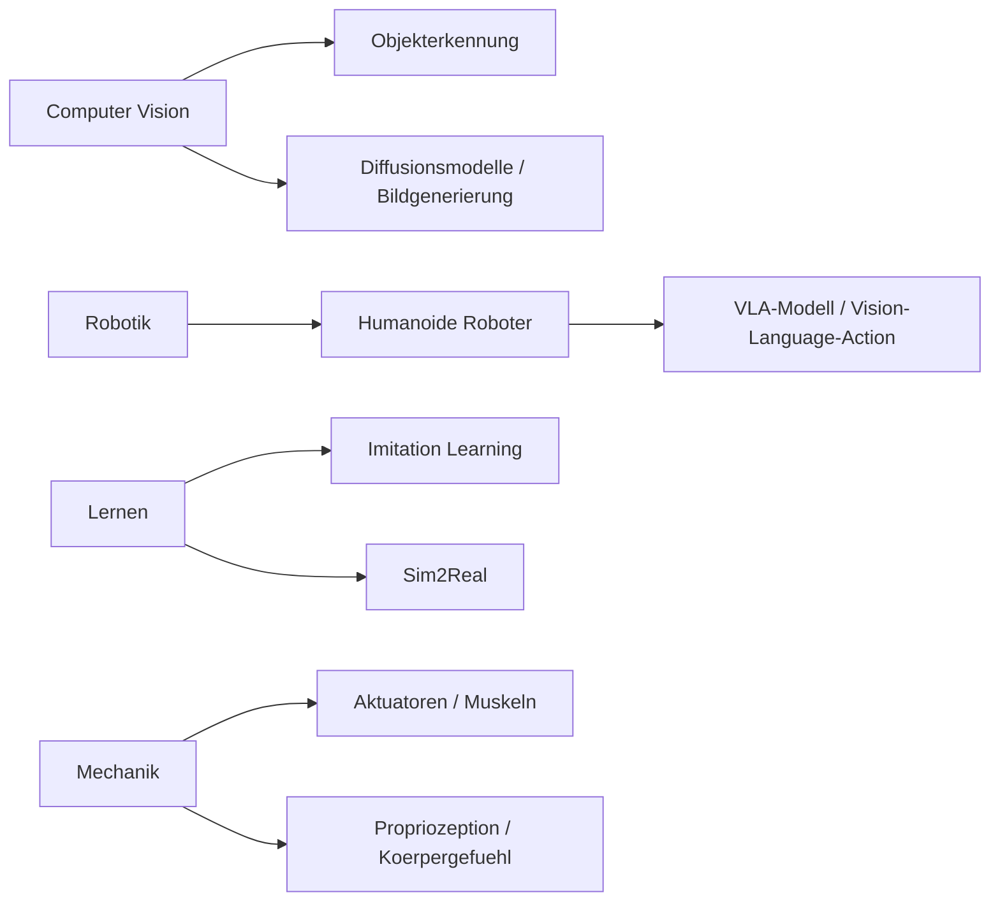
**Quellen:** [webconsulting](https://www.webconsulting.at/blog/ki-kompendium-business-bildung-2025), [Digital Neuordnung](https://digitaleneuordnung.de/blog/ki-begriffe), [Canada.ca](https://our-languages.canada.ca/en/artificial-intelligence-terminology-concept-map-eng)

| Begriff (DE) | Term (EN) | Erklärung | Zusammenhang | Quelle |
|---|---|---|---|---|
| Computer Vision | Computer Vision | Die Faehigkeit von Computern, Bilder/Videos zu „sehen“ und zu verstehen. | Genutzt fuer autonomes Fahren. | [1](https://digitalzentrum-berlin.de/blog/ki-glossar), [2](https://www.ki.nrw/ki-schluesselbegriffe/), [3](https://digitaleneuordnung.de/blog/ki-begriffe) |
| Objekterkennung | Object Detection | Das Identifizieren und Lokalisieren von Objekten in einem Bild. | Teilaufgabe von Computer Vision. | [1](https://our-languages.canada.ca/en/artificial-intelligence-terminology-concept-map-eng) |
| Diffusionsmodelle | Diffusion Models | KI-Modelle, die Bilder durch schrittweises „Entrauschen“ erzeugen. | Basis fuer Midjourney/DALL-E. | [1](https://www.webconsulting.at/blog/ki-kompendium-business-bildung-2025) |
| Humanoider Roboter | Humanoid Robot | Roboter in menschenaehnlicher Form (zwei Beine, zwei Arme). | Ziel: Nutzung menschl. Infrastruktur. | [1](https://www.webconsulting.at/blog/ki-kompendium-business-bildung-2025) |
| VLA-Modell | Vision-Language-Action | Modell, das sieht, Sprache versteht und direkt Bewegungen steuert. | „Gehirn“ fuer Allzweck-Roboter. | [1](https://www.webconsulting.at/blog/ki-kompendium-business-bildung-2025) |
| Aktuatoren | Actuators | Die „Muskeln“ eines Roboters (Motoren), die Befehle in Bewegung umsetzen. | Kernkomponente der Hardware. | [1](https://www.webconsulting.at/blog/ki-kompendium-business-bildung-2025) |
| Propriozeption | Proprioception | Das „Koerpergefuehl“ des Roboters (Wissen, wo die Gelenke sind). | Basis fuer koordinierte Bewegung. | [1](https://www.webconsulting.at/blog/ki-kompendium-business-bildung-2025) |
| Imitation Learning | Imitation Learning | Roboter lernt durch Beobachtung und Nachahmung von Menschen. | Schneller als reines Ausprobieren. | [1](https://www.webconsulting.at/blog/ki-kompendium-business-bildung-2025) |
| Sim2Real | Sim2Real | Faehigkeiten aus einer Computersimulation in die echte Welt uebertragen. | Ermoeglicht Millionen Uebungsstunden. | [1](https://www.webconsulting.at/blog/ki-kompendium-business-bildung-2025) |
| Moravec-Paradox | Moravec's Paradox | Erkenntnis: Was fuer uns schwer ist (Schach), ist fuer KI leicht (und umgekehrt). | Erklaert langsame Robotik-Fortschritte. | [1](https://www.webconsulting.at/blog/ki-kompendium-business-bildung-2025) |
| Robotik | Robotics | Ein Teilbereich der KI, der Maschinen entwickelt, die physisch mit der realen Welt interagieren. | Kombiniert Computer Vision und maschinelles Lernen, damit Maschinen selbstständig arbeiten können. | [1](https://joerg-loehr.com/ki-glossar) |
| Physische KI | Physical AI | Das Stadium, in dem Software-Intelligenz und Hardware-Motorik vollständig miteinander verschmelzen. | Ermöglicht es Robotern, reale Aufgaben in der physischen Welt autonom und sicher auszuführen. | [1](https://joerg-loehr.com/ki-glossar) |
| Kollaborative Roboter | Cobots | KI-gesteuerte Roboter, die speziell für die direkte Zusammenarbeit mit Menschen konzipiert sind. | Im Gegensatz zu isolierten Industrierobotern sind diese für die Interaktion im selben Arbeitsbereich gedacht. | – |
| Gesichtserkennung | Facial Recognition | Eine Technologie der Computer Vision, die Gesichter in Bildern oder Videos identifiziert und verifiziert. | Findet Anwendung in Sicherheitssystemen, Smartphones und sozialen Medien. | [1](https://digitalzentrum-berlin.de/blog/ki-glossar) |

## 6. Sicherheit, Ethik & Recht

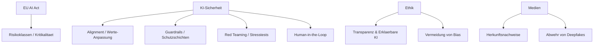
**Quellen:** [DIN](https://www.din.de/resource/blob/772610/e96445ca1cbb372071981604ca9f07a2/normungsroadmap-ki-data.pdf), [webconsulting](https://www.webconsulting.at/blog/ki-kompendium-business-bildung-2025), [SwissMed AI](https://mdai.ch/blog/von-llm-bis-halluzination/), [KI.NRW](https://www.ki.nrw/ki-schluesselbegriffe/)

| Begriff (DE) | Term (EN) | Erklärung | Zusammenhang | Quelle |
|---|---|---|---|---|
| EU AI Act | EU AI Act | Weltweit erstes Gesetz zur Regulierung von KI nach Risikoklassen. | Rechtsrahmen in Europa. | [1](https://oth-aw.de/ki-strategie), [2](https://www.ki.nrw/ki-schluesselbegriffe/), [3](https://www.webconsulting.at/blog/ki-kompendium-business-bildung-2025) |
| Kritikalitaet | Criticality | Mass fuer das Schadenspotenzial einer KI-Anwendung. | Basis fuer risikoadaptierte Regulierung. | [1](https://www.din.de/resource/blob/772610/e96445ca1cbb372071981604ca9f07a2/normungsroadmap-ki-data.pdf) |
| Alignment | Alignment | Sicherstellen, dass KI-Ziele mit menschlichen Werten uebereinstimmen. | Zentrales Sicherheitsproblem. | [1](https://www.webconsulting.at/blog/ki-kompendium-business-bildung-2025) |
| P(doom) | P(doom) | Geschaetzte Wahrscheinlichkeit einer existenziellen Katastrophe durch KI. | Debatte ueber KI-Risiken. | [1](https://www.webconsulting.at/blog/ki-kompendium-business-bildung-2025) |
| Constitutional AI | Constitutional AI | KI trainiert sich selbst anhand einer „Verfassung“ (Regeln) auf Sicherheit. | Ansatz von Anthropic (Claude). | [1](https://www.webconsulting.at/blog/ki-kompendium-business-bildung-2025) |
| Red Teaming | Red Teaming | Gezielte Experten-Angriffe, um Sicherheitsluecken in KIs zu finden. | Teil der Qualitaetssicherung. | [1](https://www.webconsulting.at/blog/ki-kompendium-business-bildung-2025) |
| Guardrails | Guardrails | Sicherheitsfilter, die verhindern, dass KI gefährliche Dinge ausgibt. | Schutzschicht fuer KI-Apps. | [1](https://www.webconsulting.at/blog/ki-kompendium-business-bildung-2025) |
| Human-in-the-Loop | Human-in-the-Loop | Ein Mensch muss KI-Ergebnisse pruefen, bevor sie genutzt werden. | Sicherheitskonzept; Mensch bleibt im Loop. | [1](https://mdai.ch/blog/von-llm-bis-halluzination/), [2](https://www.din.de/resource/blob/772610/e96445ca1cbb372071981604ca9f07a2/normungsroadmap-ki-data.pdf) |
| Bias | Bias | Systematische Fehler oder Diskriminierung durch einseitige Daten. | Problem der Fairness. | [1](https://mdai.ch/blog/von-llm-bis-halluzination/), [2](https://joerg-loehr.com/ki-glossar), [3](https://www.webconsulting.at/blog/ki-kompendium-business-bildung-2025) |
| Erklaerbare KI | Explainable AI (XAI) | Methoden, um die Entscheidungen „schwarzer Boxen“ verstehbar zu machen. | Fuer Vertrauen und Nachvollziehbarkeit. | [1](https://www.ki.nrw/ki-schluesselbegriffe/) |
| Deepfakes | Deepfake | KI-generierte Medien, die Personen taeuschend echt imitieren. | Risiko fuer Desinformation. | [1](https://www.webconsulting.at/blog/ki-kompendium-business-bildung-2025) |
| C2PA | C2PA | Technischer Standard fuer digitale Herkunftsnachweise in Bildern. | Kampf gegen Deepfakes. | [1](https://www.webconsulting.at/blog/ki-kompendium-business-bildung-2025) |
| KI-Wasserzeichen | AI Watermarking | Ein unsichtbares, maschinenlesbares Signal in KI-generierten Inhalten, das deren Herkunft nachweist. | Durch Artikel 50 des EU AI Act fuer KI-Anbieter in Europa vorgeschrieben. | [1](https://www.anthropic.com/news/claude-text-watermark) |
| Model Drift | Model Drift | Leistungsabfall einer KI, wenn sich die Aussenwelt nach dem Training aendert. | Problem im laufenden Betrieb. | [1](https://mdai.ch/blog/von-llm-bis-halluzination/) |
| KI-Governance | AI Governance | Ein verbindliches Regelwerk (Vorgaben, Freigaben, Kontrollen) für den KI-Einsatz im Unternehmen. | Garantiert eine rechtssichere und ethische Nutzung von KI-Modellen. | – |
| KI-Kompetenz | AI Literacy | Die Fähigkeit von Personen, KI-Systeme, deren Risiken und Grenzen zu verstehen und verantwortungsvoll zu nutzen. | Wird im EU AI Act explizit als Schulungspflicht für Organisationen gefordert. | [1](https://joerg-loehr.com/ki-glossar) |

## 7. Industrie & Medizin

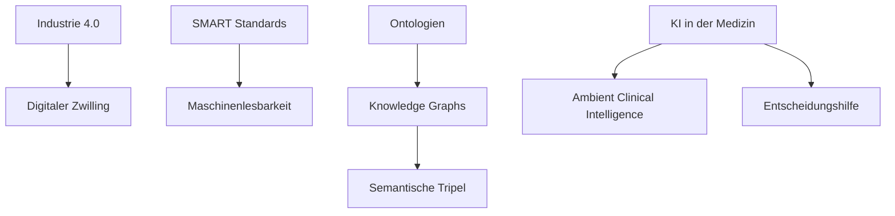
**Quellen:** [DIN](https://www.din.de/resource/blob/772610/e96445ca1cbb372071981604ca9f07a2/normungsroadmap-ki-data.pdf), [SwissMed AI](https://mdai.ch/blog/von-llm-bis-halluzination/)

| Begriff (DE) | Term (EN) | Erklärung | Zusammenhang | Quelle |
|---|---|---|---|---|
| Industrie 4.0 | Industry 4.0 | Vernetzung der Produktion durch KI und Internet der Dinge (IoT). | Rahmen fuer industrielle KI. | [1](https://www.din.de/resource/blob/772610/e96445ca1cbb372071981604ca9f07a2/normungsroadmap-ki-data.pdf) |
| Digitaler Zwilling | Digital Twin | Virtuelles Abbild eines Objekts fuer Echtzeit-Simulationen. | Optimierung in der Produktion. | [1](https://www.din.de/resource/blob/772610/e96445ca1cbb372071981604ca9f07a2/normungsroadmap-ki-data.pdf) |
| SMART Standards | SMART Standards | Normen, die direkt maschinenlesbar und fuer KIs ausfuehrbar sind. | Zukunft der Standardisierung. | [1](https://www.din.de/resource/blob/772610/e96445ca1cbb372071981604ca9f07a2/normungsroadmap-ki-data.pdf) |
| Ontologie | Ontology | Formale Beschreibung von Begriffen und Logik eines Fachgebiets. | Ermoeglicht Maschinensprache. | [1](https://www.din.de/resource/blob/772610/e96445ca1cbb372071981604ca9f07a2/normungsroadmap-ki-data.pdf) |
| Semantisches Tripel | Semantic Triple | Fakten in der Form Subjekt-Praedikat-Objekt (z.B. „A arbeitet bei B“). | Basis fuer Wissensgraphen. | [1](https://www.din.de/resource/blob/772610/e96445ca1cbb372071981604ca9f07a2/normungsroadmap-ki-data.pdf) |
| ACI | Ambient Clinical Intelligence | KI, die Arzt-Patient-Gespraeche automatisch dokumentiert. | Anwendung in der Medizin. | [1](https://mdai.ch/blog/von-llm-bis-halluzination/) |
| CDSS | Clinical Decision Support Systems | Systeme, die Aerzten medizinische Empfehlungen geben. | Unterstuetzungssysteme. | [1](https://mdai.ch/blog/von-llm-bis-halluzination/) |
| Vorausschauende Wartung | Predictive Maintenance | Einsatz von KI zur Überwachung von Anlagenzuständen, um Wartungsbedarf vorherzusagen. | Hilft in der Industrie, Ausfallzeiten zu minimieren und die Lebensdauer von Maschinen zu erhöhen. | – |
| Robotische Prozessautomatisierung | Robotic Process Automation (RPA) | Software-Roboter, die strukturierte und sich wiederholende digitale Aufgaben am PC automatisieren. | Entlastet Mitarbeiter von monotonen Klick-Aufgaben in der Verwaltung oder im Kundensupport. | – |
| Kognitives Computing | Cognitive Computing | Eine Technologie, die menschliches Denken simuliert, um personalisierte Empfehlungen zu geben. | Bietet verbesserte Funktionalität und Anpassungsfähigkeit in Bereichen wie dem Finanzwesen oder HR. | – |
| KI-Stückliste | AI Bill of Materials (AI BoM) | Eine strukturierte Liste, die alle KI-bezogenen Komponenten und Abhängigkeiten einer Pipeline identifiziert. | Dient der Transparenz und Sicherheit, um genau zu wissen, welche Modelle und Daten verwendet wurden. | – |

## 8. Hardware & Kennzahlen

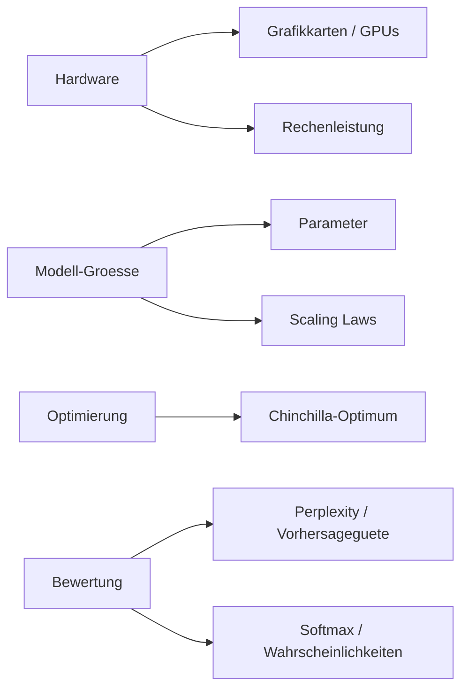
**Quellen:** [webconsulting](https://www.webconsulting.at/blog/ki-kompendium-business-bildung-2025), [DIN](https://www.din.de/resource/blob/772610/e96445ca1cbb372071981604ca9f07a2/normungsroadmap-ki-data.pdf)

| Begriff (DE) | Term (EN) | Erklärung | Zusammenhang | Quelle |
|---|---|---|---|---|
| Parameter | Parameter | Die „Stellschrauben“ im Modell, die gelerntes Wissen speichern. | Bestimmen Modellgroesse/-kraft. | [1](https://www.webconsulting.at/blog/ki-kompendium-business-bildung-2025), [2](https://www.din.de/resource/blob/772610/e96445ca1cbb372071981604ca9f07a2/normungsroadmap-ki-data.pdf) |
| GPU / Grafikkarte | Graphics Processing Unit | Spezialchips, ideal fuer parallele KI-Berechnungen. | Hardware-Basis des KI-Booms. | [1](https://www.webconsulting.at/blog/ki-kompendium-business-bildung-2025) |
| Perplexity | Perplexity | Mass fuer die Vorhersageguete eines Modells (niedrig = besser). | Metrik zur Modellbewertung. | [1](https://www.webconsulting.at/blog/ki-kompendium-business-bildung-2025) |
| Big Data | Big Data | Riesige Datenmengen, zu komplex fuer normale Programme. | Treibstoff fuer KI-Training. | [1](https://www.ki.nrw/ki-schluesselbegriffe/), [2](https://www.coursera.org/de-DE/articles/ai-vs-deep-learning-vs-machine-learning-beginners-guide) |
| Skalierbarkeit | Scalability | Die Fähigkeit eines KI-Systems, bei massiv steigenden Nutzerzahlen stabil und effizient zu bleiben. | Ist entscheidend für den unternehmensweiten Rollout von KI-Lösungen ohne Leistungsverlust. | [1](https://joerg-loehr.com/ki-glossar) |
| Edge-KI | Edge AI | Eine Form der KI-Verarbeitung, die direkt auf dem lokalen Endgerät (z. B. Handy) stattfindet. | Reduziert Latenzzeiten und erhöht den Datenschutz, da keine Daten in die Cloud gesendet werden müssen. | – |

## Visuelle Übersichtsbilder

Diese Diagramme zeigen die technischen Datenflüsse, Architekturen und Frameworks, die den Begriffen oben zugrunde liegen (übernommen aus dem ursprünglichen Wiki-Glossar, erzeugt mit NotebookLM am 05.08.2026).

### Die technische Pipeline (Vom Token zur Inferenz)
Dieses Diagramm visualisiert den "Forward Pass" innerhalb eines Transformers unter Beruecksichtigung von Optimierungen wie **Flash Attention** und **MoE**.

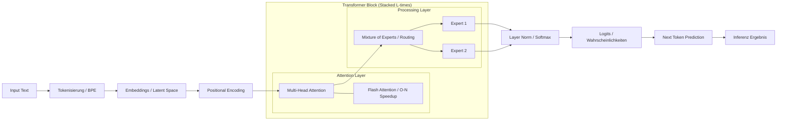
**Quellen:** [webconsulting](https://www.webconsulting.at/blog/ki-kompendium-business-bildung-2025), [dno](https://digitaleneuordnung.de/blog/ki-begriffe) [2.2, 2.18, 2.20, 4.9, 4.10]

### Der Modell-Lebenszyklus (Training, Alignment & Optimierung)
Visualisierung der Evolution eines Modells von den Rohdaten bis zum spezialisierten, ausgerichteten (aligned) Assistenten unter Einsatz von **LoRA** und **DPO**.

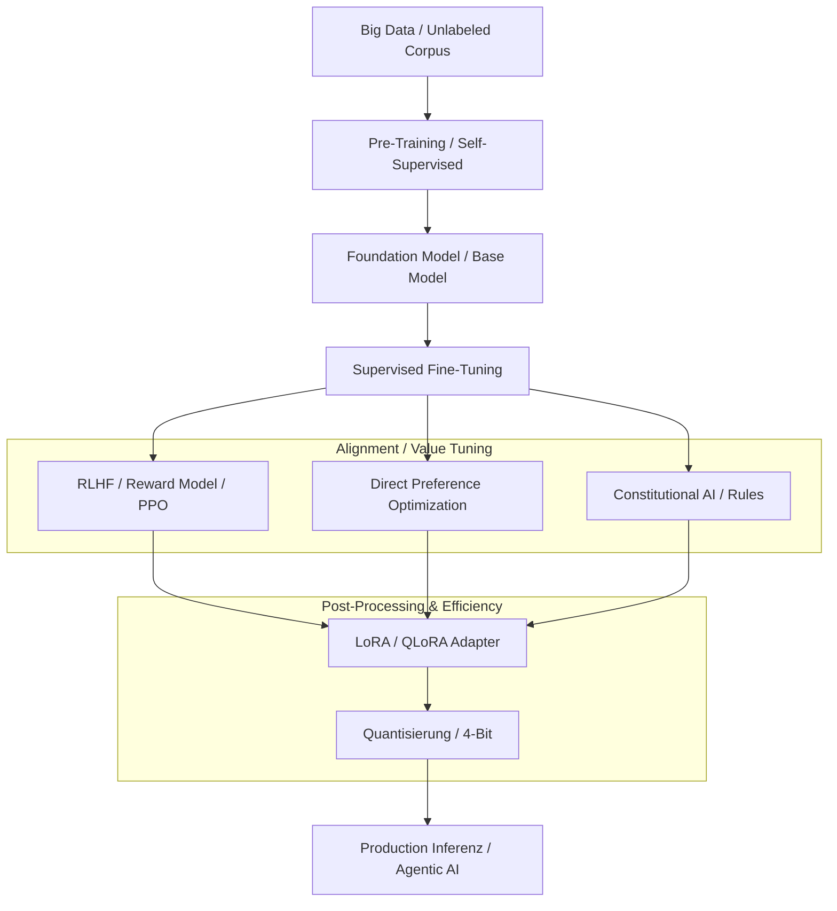
**Quellen:** [webconsulting](https://www.webconsulting.at/blog/ki-kompendium-business-bildung-2025), [Coursera](https://www.coursera.org/de-DE/articles/ai-vs-deep-learning-vs-machine-learning-beginners-guide) [1.8, 3.3, 3.5, 3.6, 6.5]

### Risiko- & Compliance-Framework (EU AI Act & NIST)
Ein hierarchisches Modell zur Einordnung von Systemen nach **Kritikalitaet** und notwendigen Schutzschichten (**Guardrails**).

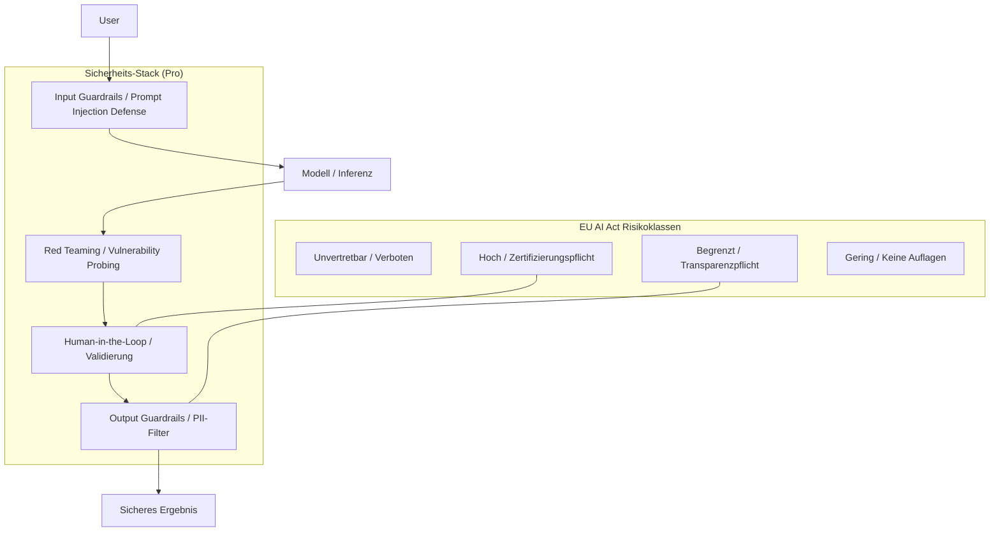
**Quellen:** [DIN](https://www.din.de/resource/blob/772610/e96445ca1cbb372071981604ca9f07a2/normungsroadmap-ki-data.pdf), [webconsulting](https://www.webconsulting.at/blog/ki-kompendium-business-bildung-2025), [SwissMed AI](https://mdai.ch/blog/von-llm-bis-halluzination/) [6.1, 4.13, 6.6, 6.9, 619]

### EU AI Act: Die vier Risikoklassen
Dieses Diagramm visualisiert die regulatorischen Stufen des EU AI Act.

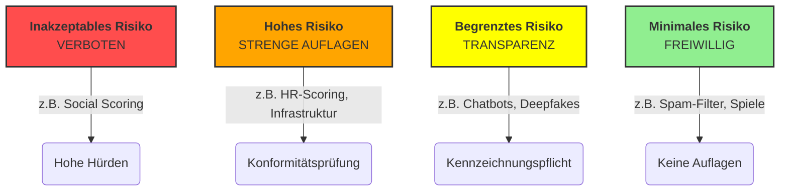

### Funktionsweise proaktiver KI-Agenten
Diese Infografik verdeutlicht den Sprung vom reaktiven Chatbot zum proaktiven Agenten. Sie stellt den sogenannten Agent Loop dar: Ein Mensch gibt ein Ziel vor, woraufhin der Agent eigenständig plant, externe Werkzeuge (wie APIs oder Web-Suche) nutzt und seine Handlungen in einer Schleife aus Beobachten, Denken und Handeln kontinuierlich bewertet, bis das Ziel erreicht ist

### Agentic AI & Reasoning (Loop-Architektur)
Dieses Diagramm zeigt, wie **Reasoning-Modelle** (wie o1) externe Protokolle (**MCP**) und Werkzeuge (**Function Calling**) nutzen, um autonom zu handeln.

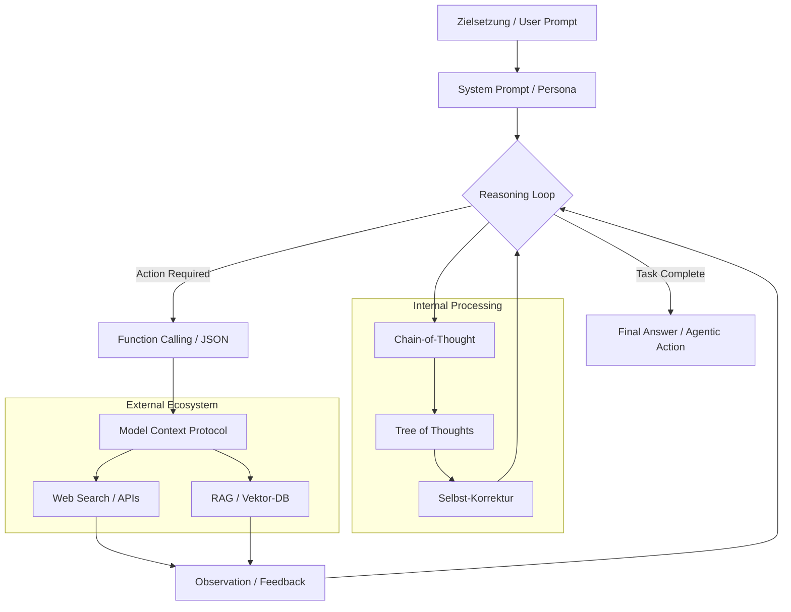
**Quellen:** [dno](https://digitaleneuordnung.de/blog/ki-begriffe) [3.13, 3.51, 4.6, 4.7, 613]

### Advanced RAG & Wissensmodellierung
Die Verbindung von unstrukturierten Daten (Chunks) mit strukturierten Normen (**SMART Standards**) und **Knowledge Graphs**.

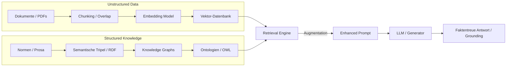
**Quellen:** [DIN](https://www.din.de/resource/blob/772610/e96445ca1cbb372071981604ca9f07a2/normungsroadmap-ki-data.pdf), [webconsulting](https://www.webconsulting.at/blog/ki-kompendium-business-bildung-2025) [4.1, 4.3, 4.4, 4.5, 308, 324]

### RAG: Das "Open-Book"-Prinzip
Die Grafik zeigt den dreistufigen Prozess, bei dem eine KI nicht nur aus ihrem Gedächtnis antwortet ("Closed-Book"), sondern wie ein Detektiv in einer externen Wissensbasis (z. B. Vektordatenbank) nachschlägt ("Open-Book")

### Vergleich: Fine-tuning vs. RAG
Dieses Diagramm zeigt den Unterschied zwischen dem Ändern des "Gehirns" (Gewichte) und dem Nutzen eines "Spickzettels" (Kontext).

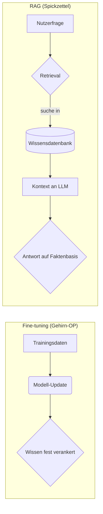

### AI Bill of Materials (AI BoM)
Visualisierung der KI-Bestandteile für Transparenz und Governance.

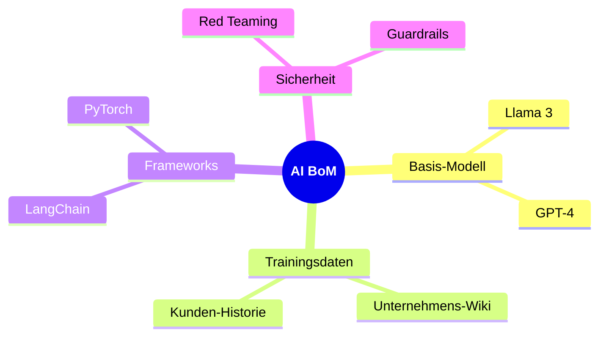

### Chain of Thought (Gedankenkette)
Stellt den schrittweisen Denkprozess dar, der die Genauigkeit bei komplexen Aufgaben erhöht.

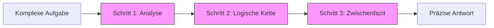

### Die Wissenspyramide (DIKW)
Visualisiert den Weg von Rohdaten zu strategischen KI-Handlungen.

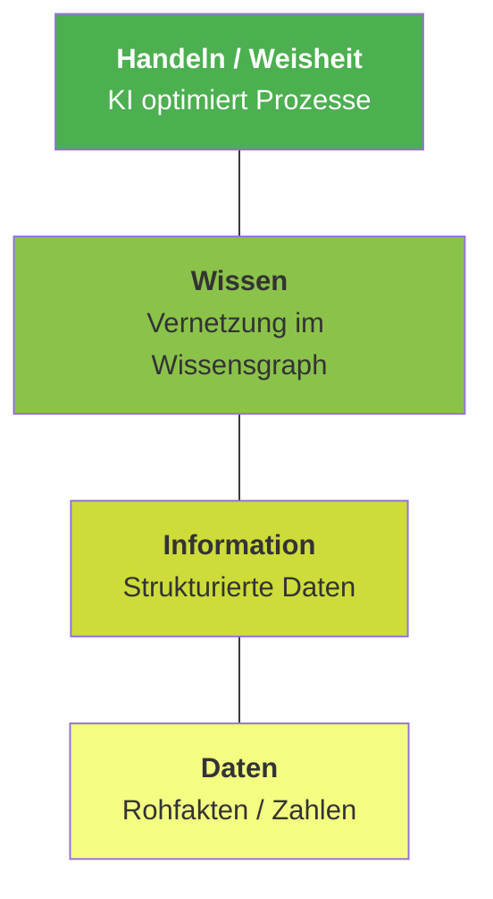

### Vibe Coding vs. Traditionelles Coden
Ein Vergleich des iterativen, KI-gestützten Flows gegenüber der klassischen Softwareentwicklung.

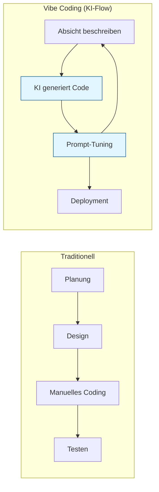
